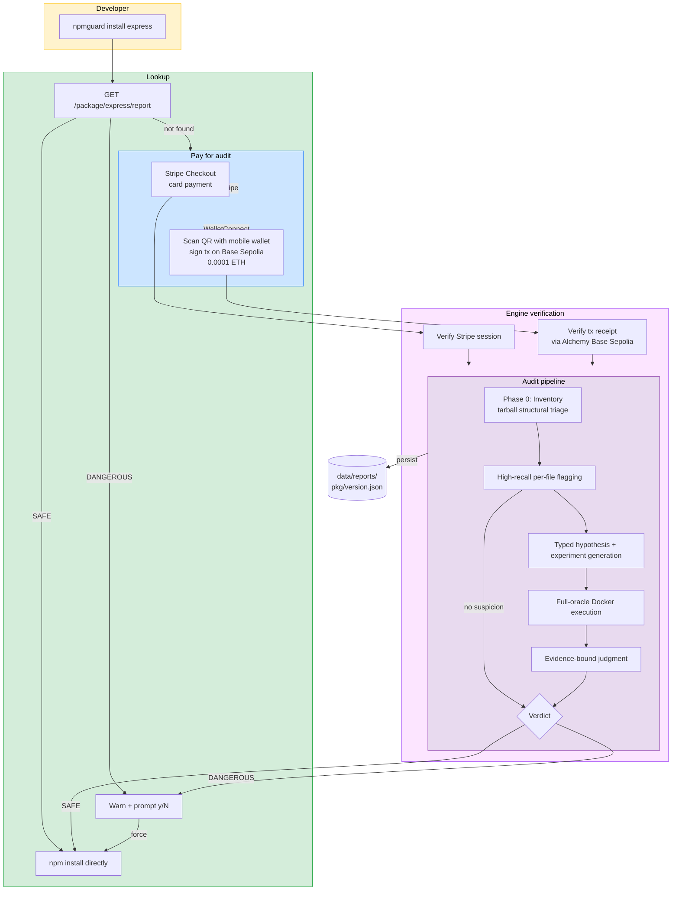

# NpmGuard

Autonomous npm supply chain security auditor. Runs npm packages through a
multi-step LLM + sandbox security pipeline and publishes verdicts via a
public API — plus a CLI that gates `npm install` behind those verdicts.

Users install packages with `npx npmguard-cli install express`. If the
package already has an audit → install happens immediately (or is blocked
if DANGEROUS). If not → the user pays for an audit with a credit card
(Stripe) or a mobile wallet (WalletConnect on Base Sepolia), the pipeline
runs, and the verdict decides whether the install proceeds.

## How it works



## Live Services

| Service | URL |
|---|---|
| Frontend Dashboard | [https://npmguard.com](https://npmguard.com) |
| Audit Engine API | [https://npmguard.com/health](https://npmguard.com/health) |
| CLI on npm | [`npmguard-cli`](https://www.npmjs.com/package/npmguard-cli) |
| Audit Contract (Base Sepolia) | [`0xBF56...B9eD`](https://sepolia.basescan.org/address/0xbf562626e4afb883423ec719e0270db232bcb9ed) |

## Quick Start

### Install a package with NpmGuard

```bash
npx npmguard-cli install express
```

- If an audit exists and the verdict is **SAFE**, it installs immediately
- If **DANGEROUS**, it warns and asks before installing (or `--force`)
- If there's no audit yet, you get a menu:
  1. **Stripe** — pay by card in the browser
  2. **WalletConnect** — scan a QR from your mobile wallet, sign a
     `0.0001 ETH` transaction on **Base Sepolia**
  3. Install without audit
  4. Cancel

After payment, the audit runs end-to-end and you see the events live in
your terminal. Open `https://npmguard.com/audit/<auditId>` for the web
dashboard view.

See [cli/README.md](cli/README.md) for the full CLI reference.

### Audit a project's dependencies

```bash
cd my-project
npx npmguard-cli check
```

Walks `package.json` and reports every dependency's audit status.

### Query the API directly

```bash
curl https://npmguard.com/package/express/report
```

```bash
curl -X POST https://npmguard.com/audit \
  -H 'Content-Type: application/json' \
  -d '{"packageName":"express","version":"5.2.1"}'
```

## Payment — Base Sepolia contract

The audit engine is gated behind a small payment so that the LLM and
sandbox compute is paid for. Two options are live:

### Stripe
Existing Stripe Checkout flow. The engine has a webhook that marks the
session paid and triggers the audit.

### WalletConnect (on Base Sepolia)
Users sign a transaction to `NpmGuardAuditRequest.requestAudit(pkg, version)`
which emits an `AuditRequested` event. The engine verifies the receipt via
a dedicated Alchemy Base Sepolia RPC and decodes the event to match the
requested `(packageName, version)` before running the audit.

- **Fee**: `0.0001 ETH` (set in contract constructor, updatable by owner)
- **Chain**: Base Sepolia (chain id 84532)
- **Contract**: [`0xBF562626e4Afb883423Ec719e0270DB232bcB9eD`](https://sepolia.basescan.org/address/0xbf562626e4afb883423ec719e0270db232bcb9ed)

Anti-replay: the engine atomically persists a `(chain, txHash)` payment claim,
so a single payment can only launch one audit even across concurrent requests
or restarts. The contract itself also prevents
double-payment for the same `(pkg, version)` pair.

See [contracts/README.md](contracts/README.md) for the contract source,
tests, and deploy instructions (Foundry).

## Project Structure

| Directory | Description |
|---|---|
| `cli/` | `npmguard-cli` — the user-facing CLI (`install`, `audit`, `check`) |
| `engine/` | FastAPI audit engine, durable state, LLM orchestration, and sandbox control |
| `frontend/` | React + Vite dashboard — live audit streaming via SSE |
| `contracts/` | `NpmGuardAuditRequest.sol` + Foundry tests + deploy scripts |
| `sandbox/` | Dynamic exploitation harness (Vitest) |
| `deploy/` | Systemd units, nginx config, webhook listener, deploy script |
| `docs/` | Architecture docs, research notes, production guides |

## Run locally

```bash
bash run.sh
# Engine on :8000, Frontend on :3000
```

Or individually:

```bash
cd engine && uv sync --all-groups && uv run uvicorn npmguard.api:app --reload
cd frontend && npm install && npm run dev           # UI on :3000
```

Testing the CLI against local engine:

```bash
cd cli && npm install && npm run build
node dist/index.js --api http://localhost:8000 install is-number
```

## Deploy

Production runs on a single DigitalOcean droplet (209.38.42.28):

- `npmguard.service` — the FastAPI engine on `:8000`
- `npmguard-webhook.service` — GitHub push webhook listener on `127.0.0.1:9000`
- nginx reverse proxy with Let's Encrypt (`npmguard.com`)
- Cloudflare in front of `npmguard.com`; `/deploy-webhook` accessed via
  raw IP to bypass Cloudflare (GitHub webhook only)

The webhook receives pushes to `main`, validates the HMAC-SHA256
signature, and spawns `deploy/pull-and-restart.sh` which pulls, runs
syncs the uv environment, runs Alembic migrations, builds the frontend, and
restarts systemd services.

Full playbook: [docs/ops/DEPLOYMENT_PLAYBOOK.md](docs/ops/DEPLOYMENT_PLAYBOOK.md)

## Tech Stack

| Component | Technology |
|---|---|
| Frontend | [React](https://react.dev/) + [Vite](https://vite.dev/) + [Tailwind](https://tailwindcss.com/) — real-time SSE dashboard |
| Audit pipeline | Python + FastAPI + Pydantic + SQLAlchemy — inventory, LLM analysis, Docker sandbox |
| LLM | [Gemini 2.5 Flash](https://ai.google.dev/) via OpenRouter (OpenAI-compatible) |
| Fiat payment | [Stripe](https://stripe.com/) checkout + webhook |
| Crypto payment | Solidity contract on [Base Sepolia](https://docs.base.org/chain/base-contracts) + WalletConnect v2 |
| Contract tooling | [Foundry](https://book.getfoundry.sh/) — compile, test (fuzz), deploy, Basescan verification |
| Chain RPC | [Alchemy](https://alchemy.com/) Base Sepolia (+ public fallback) |
| Storage | Filesystem reports plus SQLite/Postgres durable sessions/events/payment claims — no IPFS, no RPC writes |
| CLI | TypeScript, zero blockchain deps in the binary — wallet signs, engine verifies |
| Hosting | [DigitalOcean](https://www.digitalocean.com/) + nginx + Let's Encrypt |

## Team

See the repo contributors.
