# NpmGuard v3 — Platform System Design

_Status: design. Supersedes nothing; it is the umbrella the panel, frontend
rebuild, and bench-v2 work hang off._

The audit core is the fixed point. Everything else in this document is a
**consumer** of it, and every open question is about consumers.

---

## 0. The one-paragraph thesis

There is exactly one thing NpmGuard does: **take a `(package, version)` and
return an evidence-bound verdict.** Everything the product ships — the CLI, the
web app, the GitHub dashboard, the benchmark — is a different way of *deciding
which `(package, version)` pairs to ask about, who pays for it, and how the
answer is presented.* The system therefore has one hot core, one admission
point, one verdict store, and **four requesters**. The v3 work is: make all
four requesters real, honest, and provable, without touching the core.

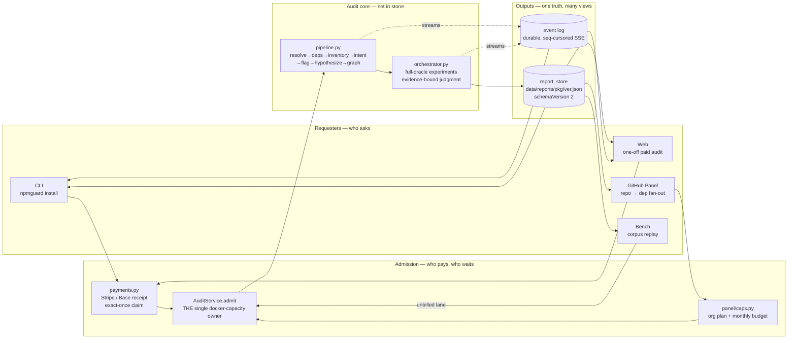

**The structural rule this design defends:** a new consumer never gets its own
pipeline, its own docker budget, or its own verdict format. It gets a *lane*
into `admit` and a *view* over `report_store`. Bench-v1 broke this rule (it
snapshotted denormalized verdict fields into `bench/results/*.json`) and that is
exactly why `/bench/results` is dead today — it still reads `capabilities`,
`proofKinds`, `TEST_CONFIRMED`, none of which exist in a schemaVersion-2 report.

---

## 1. Where we actually are

> **⚠ This section is a dated snapshot, not current state.** It records the
> inventory taken when this design was written, and it is kept because the five
> stalenesses it names are the reason Phases 0–1 exist — deleting it would
> destroy the audit trail. **Everything below is pre-`d1c4cd7`.** Phase 0
> (`0988bd7`), Phase 1 (`d1c4cd7`) and R-1 (`9999648`) have since landed and
> changed most of it. Per-item resolutions are inline below; for current status
> read the goals table in §8, which is maintained against a named commit.

Scanned the repo end to end. The honest inventory **as of the design date**:

| Capability | State | Evidence |
|---|---|---|
| Audit core (resolve→…→judge, schemaVersion 2) | **Done** | `engine/npmguard/pipeline.py`, `orchestrator.py` |
| Durable SSE + replay cursor | **Done** | `api.py:371`, `events.py`, `kit_stream/` |
| Payments (Stripe + Base, exact-once) | **Done** | `payments.py`, `persistence.py` |
| Public registry API | **Done** | `/packages`, `/package/*/report`, `/resolve/*` |
| Replay machinery (deterministic, zero-LLM) | **Exists as test plumbing** | `/demo/*`, `engine/demo-data/*.json` — only **2** recordings, no gallery, no permalink |
| **GitHub panel — backend** | **Done, ported to Python** | 44 files under `engine/npmguard/panel/**` |
| ↳ OAuth login/callback/me/logout | Done | `panel/routes/auth.py` |
| ↳ orgs → repos → scan → rollup | Done | `panel/routes/panel.py`, `panel/scan/repo_scan.py` |
| ↳ Protect (push webhook → check-run) | Done | `panel/routes/gh_webhooks.py`, `panel/github/checks.py` |
| ↳ Registry watch + daily reconcile | Done | `panel/watch.py` |
| ↳ Caps / quotas / Stripe subs | Done for *today's* plan model (checkout 501s unconfigured) | `panel/caps.py`, `panel/routes/billing.py` |
| ↳ Public-repo (read-only) audits | Done, but **sign-in + installation required** | `panel/routes/public_repos.py:247` |
| ↳ Alerts feed + ack | Done (**now committed**) | `panel/routes/panel.py:701` |
| **Frontend — pages exist** | Built, **substrate + data layer need rework** | Landing, Registry, PackageLookup, Cli, Pay, Dashboard, RepoDetail — see R-5/R-6 |
| ↳ live audit watching over SSE | Done | `audit-fold.ts`, `sse.ts`, `AuditView` |
| **Benchmark** | ~~Broken, and its premise is stale~~ → **v1 deleted, v2 derived from `audit_sets` (`16426a6`)** | v1's rule was vacuous by construction (fixtures carry `expected.capabilities: []` ⇒ `verified` 0/20). `bench.py`, `/bench/results` and the v1 TS runner are gone; `bench/METHODOLOGY-V2-DRAFT.md` supersedes the v1.1 doc. Goals G20/G21/G22 ✅ |
| **Replay gallery** (the convincer) | **Missing** | machinery exists, product surface doesn't |
| **Public repo scan, no sign-in** | **Missing** | today's public scan is authed + quota'd |
| **"How it works" page** | **Missing** | only a 3-card strip inside `Landing.tsx:237` |
| Dashboard e2e coverage | **Missing** | Playwright has no seeded GitHub session |
| **Verdict domain (panel)** | ~~Stale — 4-state~~ → **collapsed, `d1c4cd7`** | was `PanelVerdict = SAFE\|SUSPECT\|DANGEROUS\|UNKNOWN` across ~12 files; now two axes (§4.4), enforced at `verdict_index.py:43-54` + a DB `CHECK` (alembic `0007`). Goal G3 |

So the framing "kinda wired kinda not" is right, but the split is sharper than
it looks: **the panel backend is ~complete and tested; what's missing is
honesty at the edges, proof (e2e), and the config to point it at real GitHub.**
The genuinely unbuilt surfaces are **bench** and **the explainer site**.

Five concrete stalenesses found in the scan. Each is a state the code can reach
but cannot act on coherently — a hole in an invariant, not a cosmetic bug.
**Each now carries its resolution.** The citations are left at their original
values, because they name code that no longer exists and re-pointing them would
imply the defect is still there:

1. **The panel verdict domain is still 4-state.** `PanelVerdict =
   SAFE|SUSPECT|DANGEROUS|UNKNOWN` (`engine-types.ts:353`), with `SUSPECT`
   never emitted by anything and `UNKNOWN` doing double duty as "not audited
   yet" *and* "audited, couldn't tell". That conflation is precisely the "what
   the fuck does this mean" the core collapse to `SAFE / ERROR / DANGEROUS` was
   meant to kill. It survives in ~12 files: `verdict_index.py:28`,
   `repo_scan.py:111–135`, `public_repos.py:220–224`, `checks.py:33`,
   `tone.tsx:21`, `RepoDetail.tsx:41–51,189,201,219`, `Dashboard.tsx:33`,
   `PortfolioPosture.tsx:26`, `UpgradeDialog.tsx:104`, `engine-types.ts:344–417`.
   See §4.4 for the replacement model.
   → **FIXED (`d1c4cd7`, Phase 1).** Every citation above is dead: `SUSPECT` and
   `UNKNOWN` are gone from the wire, the DB and the frontend, replaced by two
   axes (`Outcome` = `SAFE|ERROR|DANGEROUS`, null until concluded; `JobState` =
   `queued|running|failed`). `verdict_index.py:28`'s `SEVERITY` map and
   `verdict_severity` were deleted after the falsification pass **disproved their
   own docstring** — it claimed they were retained "for the rollup ordering the
   wire assumes" and they had zero call sites repo-wide. Goal **G3**.
2. `panel/routes/panel.py:259` and `:688` — `"lastScan": None` is **hardcoded**
   in both `/panel/repos` and `/panel/repo/{owner}/{name}`, while
   `engine-types.ts:401` declares `lastScan: ScanSummary | null`. The field is
   structurally dead: a repo can never display when it was last scanned.
   → **FIXED (`9999648`, R-1).** Populated at `panel.py:282-288` (list, batched
   through `latest_set_rows` so it is not an N+1) and `panel.py:604` (detail).
   Goal **G7**.
3. `panelStore.refresh()` — an alerts fetch failure falls back to
   `get().alerts`, silently rendering a confident dashboard with the alerts
   banner invisibly absent.
   → **Substrate landed (`4aebcd2`, R-6b); per-path coverage still open.** The
   empty/degraded distinction is now enforced at the **type** level rather than
   by convention: `LoadState`'s failed arm has no `data` field at all, so
   `catch { setItems([]) }` has nothing to reach for. Goal **G6**.
4. `sse.ts:126 connectScanStream` — no reconnect (unlike `connectAuditStream`).
   A dropped repo-scan stream leaves a permanent spinner.
   → **FIXED by deletion (`9999648`).** There is no `connectScanStream` any more:
   the polling scan stream and the client-side report poll were both removed in
   favour of the durable log + `seq` cursor the audit stream already used. Parity
   is structural rather than maintained. Goal **G8**.
5. `/bench/results` returns `{runs: []}` forever instead of failing loud — a
   drift-locked reader that reports "no data" when the truth is "this code
   cannot read this engine's reports."
   → **FIXED by deletion (`16426a6`).** `bench.py`, the `/bench/results` route, the
   v1 TypeScript runner and its types are all gone, and v2 is derived from
   `audit_sets`. The finding's diagnosis was right but understated: the reader was
   not merely drift-locked against a v2 report, its detection rule was **vacuous
   from the start** — the fixtures carry `expected.capabilities: []`, so `verified`
   was 0/20 by construction. Goals **G20**/**G21**/**G22** ✅.

---

## 2. Functional requirements

Grouped by surface. **F-x** ids are referenced by the phase plan in §7.

### F-A · Audit core (frozen — requirements restated, not renegotiated)

- **F-A1** Given `(name, version)`, produce a schemaVersion-2 `AuditReport`:
  `{verdict, rationale, counts, confirmedHypIds, hypotheses[], fileSummaries[],
  dealbreaker, trace[]}`. Verdict domain is exactly `{SAFE, DANGEROUS}`.
- **F-A2** Audit failure is an **ERROR**, never a SAFE verdict, never a silent
  coverage gap.
- **F-A3** A suspicion is cleared only by running its compiled experiment under
  the full oracle; confirm/refute transitions require cited evidence.
- **F-A4** Stream every phase transition as a durable, seq-cursored event; a
  reconnecting client resumes exactly (idempotent replay).
- **F-A5** Reports persist to `data/reports/<pkg>/<real-version>.json`. No
  `latest.json` alias, no external pinning.

### F-B · Identity & GitHub workspace

- **F-B1** Sign in with GitHub (OAuth web flow) → HttpOnly same-origin session
  cookie; opaque server-side token; OAuth tokens encrypted at rest (AES-GCM).
- **F-B2** List the installations (orgs/users) the signed-in user can access;
  offer the App install URL when there are none.
- **F-B3** List repos per installation, with lockfile auditability state
  (auditable / confirmed non-auditable / unchecked).
- **F-B4** Every panel read is **org-scoped**: a user sees only rows belonging
  to installations in their `user_installations` cache. Enforced in SQL, not in
  the response shaper.
- **F-B5** A stale/unrefreshable OAuth token returns `401 {reauth:true}`; the
  client hard-redirects into the login flow. Branch on the *field*, never the
  message.

### F-C · Repo scanning (the "scan repos for packages → audits" spine)

- **F-C1** On demand (`POST /panel/repo/{id}/scan`), resolve the repo's root
  lockfile (npm / pnpm / yarn), parse it to a deduped `(name, version)` set,
  persist it as the repo's dependency index.
- **F-C2** Create an `AuditSet` whose `audit_set_items` are the exact set
  covered; progress is computed **from those rows**, never from a counter.
- **F-C3** Every uncached `(name, version)` becomes a `PanelJob`; jobs dedupe
  cross-SET via a partial-unique index on `(package_name, version)` while
  active. Cached ones resolve instantly from `package_verdicts`.
- **F-C4** Workers drain jobs into `AuditService.admit` — the single docker-cap
  owner. The panel never opens a second capacity budget.
- **F-C5** Roll up dep outcomes into one repo posture over the **3-state**
  domain `SAFE / ERROR / DANGEROUS` (§4.4). Progress ("12 of 340 still
  running") is a **separate axis**, never a verdict value. Severity order is
  `DANGEROUS > ERROR > SAFE`.
- **F-C6** Stream scan progress over SSE (`/panel/scan/{id}/events`) and
  **reconnect on drop**, resuming from server state.
- **F-C7** Surface a repo's last scan (when, trigger, outcome) — currently the
  dead `lastScan` field.
- **F-C8** Drill through from a repo to any dependency's full audit report.

### F-D · Continuous protection

- **F-D1** Toggle Protect per repo (quota-gated). Enabling triggers a first
  full scan in the background; the toggle responds immediately.
- **F-D2** A `push` webhook touching the lockfile triggers a **delta** scan
  (only changed deps) and posts a GitHub check-run with the rollup.
- **F-D3** Registry-watch ETag-polls every package used by a protected repo; a
  newly published version is audited **proactively** and, when DANGEROUS, fans
  out an alert. Watch audits are `org=NULL` — cache-filling, never billed.
- **F-D4** A daily reconcile compares each protected repo's lockfile blob SHA
  and re-scans only on real drift (heals webhooks missed while down).
- **F-D5** Alerts are org-scoped, feed-shaped, and whole-feed acknowledgeable.
  **Email/SMTP is explicitly out of scope** — alerts stay DB-only.

### F-E · Billing & quotas — **provisional; treat as a policy layer**

The plan model is **not settled**. Current direction: a subscription, plus
per-audit purchase when you need more than the subscription covers. The design
requirement is therefore about the *seam*, not the prices.

- **F-E1** An installation *is* the billing account. Whether it's plan-shaped,
  credit-shaped, or both is a **policy decision behind one function**:
  "may this requester start this audit, and what does it cost them?"
- **F-E2** Everything downstream of that seam consumes an **entitlements
  projection** — a resource-keyed `{used, limit, remaining}` snapshot — and
  never the plan enum. Adding per-audit credits must be a new resource in the
  projection, not a new branch in the UI.
- **F-E3** Exceeding a cap returns `402 {error, cap:true, resource,
  installationId, entitlements}` — the body carries **fresh** entitlements so
  the client patches its ledger from the same response that opened the paywall.
- **F-E4** Unconfigured billing returns a loud `501`, never a fake success.
- **F-E5** No table, wire shape, or component may encode "free vs pro" as a
  two-valued fact. Today's `plan` field is a *derived label for display*; the
  authority is the projection.

### F-I · Replay — the convincer

The fastest honest way to show a skeptic the tool works is to let them watch a
real audit happen, on demand, without paying or waiting.

**This section was rewritten after the feature landed, and the rewrite is the
point.** It previously specified a curated set of *recorded* audits keyed by an
authored `slug`, with `whyInteresting` prose, contract pins, and a
`POST /replays/{slug}/start`. That model was wrong about where a replay comes
from: the engine appends every frame of every audit to a durable, seq-cursored
log, and `/audit/{id}/events` already replays a terminal session from `seq` 0.
So there is nothing to record. An audit that finished **is** a replay, and the
only thing that was ever missing was a way to learn its id.

Everything the old shape added existed to compensate for scarcity — two
hand-curated exhibits, each costing real model spend to produce, whose curated
fields drifted from engine output and needed pinning to stay honest. Removing
the recording step removes the scarcity, and with it the curation, the pins, and
the divergence they were pinning.

- **F-I1** Every audit that reaches a verdict is replayable by anyone, at any
  time, with zero LLM and zero Docker cost. No recording step, no curation, and
  no per-exhibit money.
- **F-I2** Replays are **browsable** — `GET /replays` lists package, version,
  verdict, duration and when it ran, newest first. Every value is read back off
  the audit row and its stored report, so no field can describe a run
  differently from how it went.
- **F-I3** The permalink is `/audit/{auditId}`, and the id is load-bearing.
  `data/reports/{name}/{version}.json` keeps only the **last** audit of a pair,
  so a `(name, version)` link silently repoints after a re-audit while looking
  unchanged. `audit_sessions` keeps every run. This is also why F-F3's
  canonicalization must not apply to a replay.
- **F-I4** A replay is byte-identical to the run it replays — same SSE fold,
  same components, same durable frames — and is **unmistakably labelled as a
  replay** for exactly that reason. Speed is tunable (`NPMGUARD_DEMO_SPEED`) for
  the committed recordings; a durable-log replay streams as fast as the client
  reads.
- **F-I5** Coverage is a consequence of use, not a curation task: whatever this
  engine has audited is what the gallery shows. The interesting middles — a
  DEFERRED hypothesis, an audit that could not prove what it suspected — appear
  the moment one is run, with no decision about whether to pay to record it.
  Audits that could not conclude are `error`, carry no report, and are not
  listed: a gallery row promises a verdict.
- **F-I6** No contract pins, because there is no authored artifact to pin. A
  replay re-emits the frames the engine actually emitted. The one read boundary
  that remains is the **verdict domain**: `data/reports/` is shared byte-for-byte
  with a lineage that writes a 4-state classification into `verdict`, so a report
  outside the contract's domain is dropped rather than handed to a client with no
  branch for it.

**Not superseded, still true:** the committed recordings under
`engine/demo-data/` remain the Landing "see it run" path and the e2e fixture, and
they remain hybrids whose hand-authored fields contradict engine output (D-9).
They are excluded from this gallery — listing them would show one exhibit twice
under two identities. Whether to re-record them is unchanged and still an owner
decision with a dollar attached.

### F-F · Public (unauthenticated / one-off) audits

- **F-F1** Anyone can look up an existing report by `(name, version)` without
  paying; only *producing* a new audit costs.
- **F-F2** Paid one-off audit via Stripe Checkout **or** Base Sepolia receipt;
  verification and the exact-once claim happen server-side before any work
  starts.
- **F-F3** Live-watch any audit at `/audit/:id`; on verdict the URL
  canonicalizes to the durable `/package/<name>` report — **except when the
  session was reached BY that URL** (a replay, F-I3). Canonicalizing there would
  rewrite a link addressing one run into one addressing whichever run is stored
  last, and nothing on screen would say so.
- **F-F4** Read-only **public-repo** audits (scan any public GitHub repo you
  don't own) — snapshot-shaped, never joined into the owned-repo tables.
- **F-F5** **Scanning a public repo requires a GitHub sign-in, but nothing
  more** — no App installation, no repo ownership, no installation charged.
  *(D-1, decided.)* Today `POST /panel/public-repos/scan` additionally demands
  an `installationId` to bill, which makes the scan unreachable for a signed-in
  user who hasn't installed the App anywhere. Drop that requirement: the scan
  already uses an **unauthenticated** Octokit client and 403s on private repos,
  so the GitHub-side capability is auth-free; only the billing hook isn't.
- **F-F6** The sign-in *is* the abuse ceiling — a GitHub account is identity, so
  no rate-limit-by-IP or captcha layer is needed. What remains is **cost**
  control, not abuse control: a dep-count cap per scan (a 900-dep monorepo can't
  be one free scan), a per-user concurrent-scan limit, and a queue lane that can
  never starve paid or panel work.

### F-G · Benchmark — **premise is stale; needs a design pass before code**

`METHODOLOGY.md` is v1.1, dated April, and predates the triage/hypothesis
redesign, the evidence-timeline + judge rework, and the schemaVersion-2 report.
Its measurement primitives are gone: it scores on `expectedCapabilities ⊆
report.capabilities` and `proof.kind === "TEST_CONFIRMED"`, neither of which
exists any more. **Porting the v1 runner would be porting a stale question.**

So Phase 7 starts with a *design* deliverable, not a schema. The requirements
below are the ones I'm confident survive any redesign; the open question is
what replaces the scoring rule (O-2).

- **F-G1** Drive a pinned corpus through the **live engine via the normal
  admission path**, N runs per entry. The bench is never a second pipeline.
- **F-G2** Persist **observations only** per run item — at minimum `audit_id`,
  `verdict`, duration, token counts. Every *judgment* (detected / missed /
  false positive) is **derived at read time** from `expected × observed`. The
  report stays on disk, so a scoring-rule change re-projects history instead of
  invalidating it. This rule is *why* v1 died and is non-negotiable regardless
  of what the new scoring rule turns out to be.
- **F-G3** Report rates with **stated uncertainty** (Wilson 95% CIs), never
  bare point estimates, and report what the tool **misses** as prominently as
  what it catches.
- **F-G4** Report cost & latency: p50/p95/p99 wall clock, LLM tokens, sandbox
  time. A reader must know what a re-run costs *before* running it.
- **F-G5** A run is fully described by `(datasetVersion, engineSha, modelId,
  sandboxImageDigest)`; all four are stored with the run.
- **F-G6** Publish runs read-only over the API and render them at `/benchmark`.
- **F-G7** Corpus fixtures are live malware: **never** installed or executed
  outside the Docker sandbox, never committed.

### F-H · Web surfaces

- **F-H1** `/` Landing — value prop, one-shot audit launcher, inline replay.
- **F-H2** `/how-it-works` — **new**, and **fully static**: no engine calls, no
  loading state, no failure mode. Prose + diagrams + a frozen worked example,
  build-time only. Explains the pipeline stage by stage, what "evidence-bound"
  means, the threat model, and what NpmGuard does *not* claim. Being static it
  can never be wrong about *runtime* state — but it **can** go stale about the
  pipeline, so it names the engine version it describes.
- **F-H3** `/packages` registry + `/package/*` report view.
- **F-H4** `/audit/:id` live audit watching over SSE.
- **F-H5** `/replays` — **new** replay gallery (F-I2). It has no permalink route
  of its own: a row links to `/audit/:id` (F-H4), which is the permalink (F-I3).
- **F-H6** `/scan` — **new** public-repo scan entry: paste any public repo,
  watch its supply chain resolve (F-F5).
- **F-H7** `/dashboard` + `/repo/:owner/:name` — the GitHub panel UI.
- **F-H8** `/benchmark` — **new** benchmark site (run picker, metric tiles with
  CIs, misses as prominent as hits, methodology link).
- **F-H9** `/cli`, `/pay` — install instructions and the payment flow.
- **F-H10** **Every dynamic** surface degrades visibly: a failed sub-fetch
  renders a named degraded state, never a confident view built on partial data.

---

## 3. Non-functional requirements

**N-0 · Quality over shortcuts, in every decision across design and code.**
This outranks every other line in this document, and it's a tie-breaker with
teeth, not a slogan. When two options are on the table:

- The one that removes a bug *class* beats the one that fixes an instance.
- The one that makes a bad state unrepresentable beats the one that handles it.
- "Rewrite it properly now" beats "wrap it and move on" — including when the
  thing being rewritten is recent work, and including when it breaks
  compatibility. Sunk cost is not an argument.
- An existing doc, convention, or prior decision **does not get a vote against
  quality.** If it's wrong it gets rewritten, not cited. (`frontend/CLAUDE.md`
  is the live example — see R-6.)
- Effort is not a tie-breaker. Cost is a *scheduling* input; it never converts a
  worse design into the right one.

Practical corollary: where this document says "port the proven behaviour", it
means port the *behaviour*, never the *shape*. Everything ported gets re-judged
on merit at the moment it lands.

**N-1 · Trust boundaries are server-side.** Payment verification
(`payments.py`) and quota enforcement (`panel/caps.py`) gate execution on the
server. The CLI and the browser observe; they never authorize. No private-key
path may exist in the CLI or the web app (grep-enforced).

**N-2 · One capacity owner.** `AuditService.admit` is the only thing that
decides an audit may start running. Every lane — paid, panel, watch, bench —
queues behind it. Adding a lane must not add a docker budget.

**N-3 · Honest degradation.** A component that cannot get its data says so.
Forbidden: fabricated zeros, silent `catch {}`, a green verdict synthesized from
a crash, an empty list standing in for a failed read. `/bench/results` returning
`{runs: []}` because it can't parse v2 is the canonical violation.

**N-4 · Complexity is measured in reachable states, and invariants are how we
shrink it.**

At any point in execution there is a **state** — the set of facts currently
true. A line of code must handle whichever states can *reach* it, so every
unguarded possibility becomes a branch. **An invariant is a fact guaranteed true
at a point regardless of path.** It shrinks the reachable-state set, and the
branches that existed to handle the excluded states then delete themselves.
Complexity scales with reachable states, so each real invariant collapses
complexity combinatorially. That is the whole method: *a simple solution to a
complex problem*, reached by forbidding states rather than handling them.

Missing invariants show up as three named symptoms, and we treat all three as
the same defect:

- **ifology** — dense `if`/`else`/`switch`/`?.`/`== null` guards compensating
  for not knowing the state.
- **ducttape** — a special-case patch for a state that "shouldn't" arrive but
  does. Always a hole upstream, never a local fix.
- **haziness** — code where you cannot *state* what's true, so a branch can't
  be judged dead vs load-bearing.

The rules that make this safe rather than reckless:

1. **Incoherent state ⇒ make it unreachable.** If a boundary can reach a state
   it cannot act on — nothing meaningful to do, nothing to check — that is not
   a branch to write, it's a hole to close at the boundary. Handling it is
   ducttape; forbidding it is the invariant. *`UNKNOWN` meaning both "not
   audited yet" and "audited, can't tell" is exactly this: two incompatible
   facts wearing one name, so no downstream branch can be correct.*
2. **Root cause is usually non-local.** The branching may be here while the
   guarantee that removes it belongs **upstream**. Fix it at the stage that
   *owns* the invariant, then delete the downstream branches. A local guard on
   a symptom is the ducttape we're removing.
3. **Delete-iff-asserted.** A branch may be removed **only if** an assert now
   catches the deleted case loudly. If the invariant turns out subtly wrong,
   the assert converts silent corruption into an immediate, located failure. No
   assert covering it ⇒ keep the branch.
4. **Earn the deletion.** Being confident authorizes *intent*, not the
   *deletion*. Before removing a branch, try to **falsify** the invariant with
   an independent pass that hunts for a reachable state violating it — the
   context that proposed an invariant is biased toward it. A counterexample
   goes back to the user; never delete over one.
5. **Assert where it earns its keep.** At the boundary, about *this* boundary's
   contract. Do **not** re-assert what an upstream invariant already
   guarantees — re-checking reintroduces the work the invariant exists to
   remove.
6. **The ledger is the code, not a doc.** An invariant lives at the boundary it
   constrains as an assert **plus** a terse `# INVARIANT: …` comment carrying
   the semantics the assert can't. Docs drift; the code is the source of truth.
   Coverage is discoverable by grepping `INVARIANT:`.
7. **Atomicity.** Comment + assert + branch deletion land together, green.
   Never a deleted branch without its assert, never a red tree between
   invariants.

Live examples in this repo, all five items in §1: the 4-state verdict domain
(incoherent state), the hardcoded `lastScan: None` (haziness — a field whose
declared type promises what the code can never supply), the
`Promise.allSettled` swallow (ducttape hiding a failed read), and
`/bench/results` returning `[]` (ducttape hiding a schema mismatch).

**N-4b · Value is complexity removed, not annotation coverage.** This is not a
mandate to document every function's contract. Only boundaries where a missing
invariant is *actively* causing branching get worked, worst-first, one at a
time — and the codebase is never "done", because there is always a next-worst.

**N-5 · Determinism where it's testable.** LLM traffic replays from
content-matched, prompt-hash-pinned fixtures; the demo path replays committed
recordings with zero LLM and zero docker. Editing a prompt requires a re-record
and fails loud otherwise.

**N-6 · Hermetic tests.** `npm test` / `uv run pytest` pass on a fresh clone
with nothing running and **must not** read a developer's `.env`. Panel-on is an
explicit per-test opt-in, asserted at conftest level.

**N-7 · Discriminating tests.** A regression test that cannot fail against the
pre-fix code is theater. Prove the failure before claiming the fix.

**N-8 · Secrets never leak.** OAuth tokens encrypted at rest (AES-256-GCM);
`.env` and `*.pem` gitignored; no secret value in logs, commits, or agent
context — labels only.

**N-9 · Multi-tenant isolation.** Org scoping is enforced in the query, and
proved in tests **against the database**, not against the response body.

**N-10 · Graceful shutdown.** Worker loops exit at a no-resources boundary
(stop-flag checked between jobs); `cancel()` is a timeout backstop only.
Cancelling a task parked in a DB session leaks its pooled connection.

**N-11 · Portability across the storage axis.** Every schema decision works on
both SQLite (dev) and Postgres (prod) — partial-unique indexes supply both
`sqlite_where` and `postgresql_where`; no `COLLATE NOCASE`.

**N-12 · One contract, codegen'd — the panel joins it.** Today the core audit
domain is generated (`shared/src/*.ts` → `scripts/gen-contract.sh` →
`contract/models.py`) while the **panel domain is hand-mirrored** between route
dicts and `frontend/src/lib/engine-types.ts`. That is a structural defect, not a
convention: two hand-kept copies of the same shape is a reachable state where
they disagree, and §1's `lastScan` is that state already occurring — the TS
declares `ScanSummary | null`, the Python hardcodes `None`, and nothing can
catch it because nothing checks.

**The panel domain moves into `shared/` and gets generated, same as the core.**
Bench goes in from day one rather than repeating the mistake a third time. After
that:

- A panel wire change is one edit in `shared/src/panel.ts`, regenerated to both
  sides. Divergence stops being *possible* rather than being *policed*.
- The hand-written half of `engine-types.ts` shrinks to whatever genuinely has
  no schema (nothing, if this is done right).
- The parity test that exists to catch drift becomes redundant for the panel and
  is kept only where the engine emits something schema-free.

This is the highest-leverage invariant available in the whole design: it deletes
an entire *class* of bug rather than an instance, and it makes every later panel
change cheaper. Sequence it **first** (§7 Phase 0) — every phase after it
benefits, and doing it late means hand-mirroring all the new bench, replay, and
public-scan shapes and then throwing that work away.

**N-13 · Cost predictability.** A bench run's cost is computable from
`(entries × runs × observed per-audit token cost)` before it starts, and
reported after.

**N-14 · Feature gating is total.** With GitHub App creds absent, every panel
route 503s and the engine is otherwise unaffected. The same discipline applies
to Stripe (501) and to bench (empty corpus ⇒ explicit "no corpus", not "0%").

---

## 4. Entities

Three domains. The core is frozen, the panel is built, bench is new.

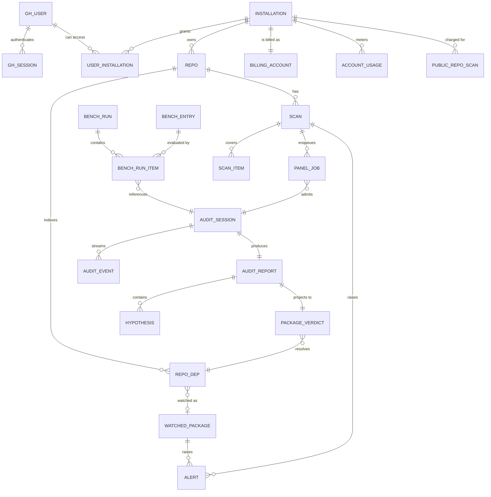

### 4.1 Core audit domain — **frozen**

| Entity | Key | Notes |
|---|---|---|
| `AuditSession` | `audit_id` | status, package, version, resolved path; restart-recoverable |
| `AuditEvent` | `(audit_id, seq)` | durable log; SSE replay cursor; 17 live types |
| `AuditReport` | `(name, version)` on disk | schemaVersion 2; the single source of verdict truth |
| `Hypothesis` | `hypId` within a report | claim, state `CONFIRMED/REFUTED/DEFERRED`, severity, cited evidence |
| `PaymentClaim` | `(chain, txHash)` \| `stripeSessionId` | atomic, exact-once — one payment ⇒ one audit |

### 4.2 Panel domain — **built** (`panel/tables.py`)

`gh_users`, `gh_sessions`, `installations`, `user_installations`, `repos`,
`repo_deps`, `audit_sets`, `audit_set_items`, `package_verdicts`, `panel_jobs`,
`watched_packages`, `billing_accounts`, `account_usage`, `alerts`,
`public_repo_scans`.

`audit_sets` / `audit_set_items` are R-1, landed: they replaced
`scans`/`scan_items` and the progress half of
`public_repo_scans`/`public_repo_scan_items`, and `public_repo_scans` is now a
pure *subject* row (which public repo, who asked) keyed by `set_id`.

Load-bearing invariants encoded in the schema, worth naming because the design
depends on them:

- **`ix_panel_jobs_active_pkg`** — partial-unique on `(package_name, version)`
  while `state IN ('queued','running')`. This is *what makes fan-out safe*: two
  repos depending on `lodash@4.17.21` produce one audit, not two. Its corollary
  is that a shared job belongs to no single set, which is why a settle notifies
  every set covering the pair rather than "its own".
- **`ix_audit_sets_active_public`** — partial-unique on
  `(origin_ref, requested_by)` while `finished_at IS NULL AND origin =
  'public_repo_scan'`. Origin-scoped on purpose: the same statement is **false**
  for `repo_scan`, where two pushes in quick succession legitimately open two
  overlapping sets, each with its own check run. The second column was
  `billed_to` until D-1 removed the payer from this origin entirely (alembic
  0008): a partial-unique index whose key column is NULL for every row it covers
  guarantees nothing, since distinct NULLs are distinct — it would have kept
  *looking* enforced while admitting unlimited duplicates. Scoped per requester
  rather than globally because the dedupe that saves WORK is
  `ix_panel_jobs_active_pkg`; this one only stops one user opening the same set
  twice.
- **No stored `status` and no stored counter on a set.** `finished_at` is the
  single liveness fact and every counter is recomputed from
  `audit_set_items ⋈ package_verdicts` on read. `status='failed'` and a set-level
  `error` text column were both removed: the falsification pass found zero
  producers for either, and every way a set can go wrong resolves into its rollup
  as `ERROR`.
- **`package_verdicts`** is a **derived, rebuildable** index of
  `data/reports/`. It is a cache, never a second source of truth. Anything that
  disagrees with the report on disk is a bug in the projector.

### 4.3 Bench domain — **new**

Modeled the same way as the panel: real tables on the shared metadata, not a
directory of snapshot JSON.

| Entity | Key | Fields |
|---|---|---|
| `bench_corpora` | `(name, version)` | `datasetVersion`, `source` (`datadog`/`negative-control`/`watchlist`), `manifestSha`, `generatedAt` |
| `bench_entries` | `(corpus_id, fixture_name)` | `package_name`, `version`, `category`, `expected_verdict`, `discovery_date`, `rationale`, `source_id` |
| `bench_runs` | `run_id` | `corpus_id`, `engine_sha`, `model_id`, `sandbox_image_digest`, `runs_per_entry`, `status`, `started_at`, `finished_at`, `token_cost_usd` |
| `bench_run_items` | `(run_id, entry_id, run_index)` | `audit_id`, `verdict`, `duration_ms`, `error`, `confirmed_count`, `dealbreaker`, `tokens_prompt`, `tokens_completion` |

**The design decision that kills the drift class:** `bench_run_items` stores
*observations* (`verdict`, `confirmed_count`, `audit_id`), never *judgments*
(`detected`, `status`, `proofKinds`). Outcome and every aggregate are derived
on read from `expected × observed`. When the report schema evolves again, the
projector changes and historical runs keep rendering — because the row holds
the `audit_id` and the report is still retrievable.

★ **Retrieved from where, exactly — this trap would have silently voided the
re-projection guarantee.** There are **two** report stores with different keys:

| Store | Key | Purpose |
|---|---|---|
| `audit_sessions.report` (JSON column, `persistence.py:25`) | **`audit_id`** | the record of *one audit run* |
| `data/reports/<pkg>/<version>.json` (`report_store.py:92`) | **`(name, version)`** | the *published* verdict for a package |

A bench run audits the same `(name, version)` N times. The filesystem store keeps
only the **last** of those N — so a projector reading `data/reports/` would
silently collapse N observations into one and G24's "re-derive from stored
`audit_id`s" would fail while appearing to work.

**The bench projector reads `audit_sessions.report` by `audit_id`. Never
`report_store`.** (Related: `TESTING.md`'s FINDINGS already records an observed
reports-vs-DB desync — the two stores are not guaranteed consistent, which is a
second reason not to treat them as interchangeable.)

★ **And the bench lane must force a fresh audit per run index.** Otherwise the
cache serves the first run's report to every repeat, unanimity is 100% *by
construction*, and any stability/variance number the bench publishes is a lie.

### 4.4 The verdict model — two axes, three states

The current 4-state `PanelVerdict` is one axis doing two jobs. Split it.

**Axis 1 — progress.** Has an audit attempt for this `(name, version)`
concluded? `unaudited → queued → running → concluded`. This is the panel's
existing `jobState`, and it is *never* a verdict.

**Axis 2 — outcome, only meaningful once concluded.** Exactly three states,
exhaustive and mutually exclusive:

| Outcome | Means | Check-run | Blocks install |
|---|---|---|---|
| `SAFE` | Audit concluded; no confirmed threat | `success` | no |
| `DANGEROUS` | Audit concluded; ≥1 confirmed hypothesis or a dealbreaker | `failure` | yes |
| `ERROR` | The audit **could not conclude** — crash, timeout, unresolvable | `neutral` | no, but never claims safe |

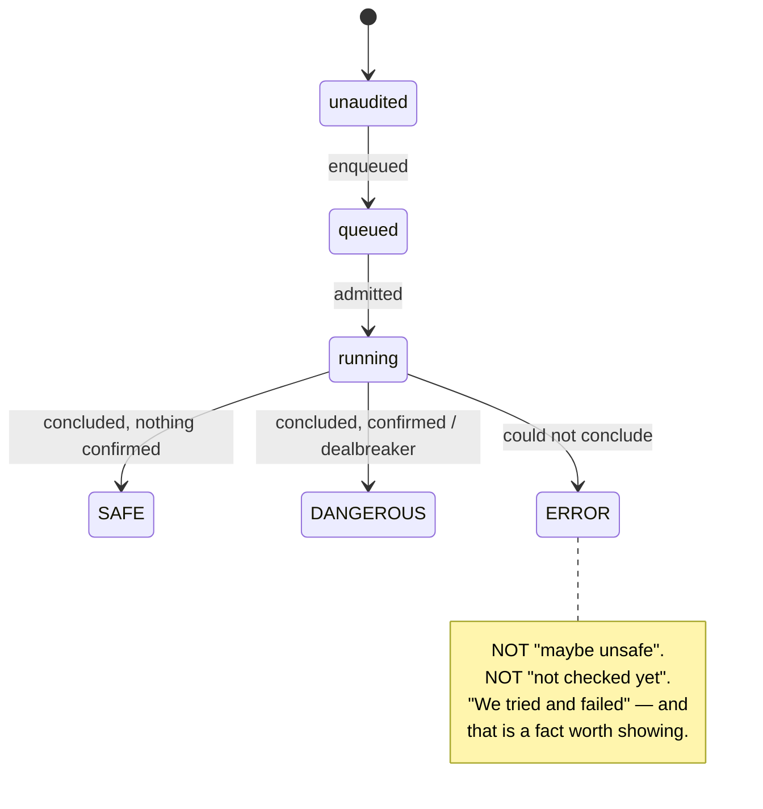

Why this is the invariant and not a preference:

- **`SUSPECT` was never emitted by anything** — a reserved-but-unreachable state
  that nevertheless forced a branch in ~8 files. Unreachable states are pure
  cost: they cannot be tested, cannot be trusted, and every reader has to
  re-derive that they're dead.
- **`UNKNOWN` was two facts under one name** — "not audited yet" (progress) and
  "audit failed" (outcome). No downstream branch on `UNKNOWN` can be correct,
  because the right behaviour differs between them: pending should show a
  spinner and resolve itself; failed should show a failure and needs a retry.
  This is §4's *incoherent state* case — the fix is to make it unreachable by
  splitting it, not to add a handler.
- **`ERROR` as a first-class outcome enforces N-3.** The core already says
  audit failure is an ERROR, never a SAFE verdict. The panel silently violated
  the spirit of that by folding failures into a bucket that renders as "not
  flagged". A repo with 40 deps where 12 audits crashed is **not** a green repo,
  and the rollup must say so.

Rollup severity: `DANGEROUS > ERROR > SAFE`. A repo's posture is the max over
its concluded deps, carried alongside a separate pending count. `null` on the
wire means "nothing concluded yet" — read `jobState` for what's happening.

Cost of the change: one `PanelVerdict` type, `verdict_index.SEVERITY`,
`compute_rollup`, the check-run mapper, the two sort ranks, the rollup counters,
and the tone map. Sequenced *after* N-12 (panel-in-shared) so it's a single
generated-contract edit rather than a hand-mirrored one.

---

## 5. API surface

### 5.1 Existing — public / audit core (stable)

| Method | Path | Purpose |
|---|---|---|
| GET | `/health` | liveness |
| POST | `/audit` | enqueue (202) |
| POST | `/audit/stream` | paid entry point — Stripe / Base / dev-free |
| GET | `/audit/{id}/events` | SSE, named events, `Last-Event-ID` / `?since=` |
| GET | `/audit/{id}/file/{path}` | source viewer |
| GET | `/audit/{id}/report` | live report |
| GET | `/packages` · `/package/{name}/report` · `/resolve/{name}` | registry |
| POST | `/checkout` · GET `/checkout/{id}/status` · POST `/webhooks/stripe` | payment |
| GET | `/config/public` | chain, contract, fee, feature flags |
| GET | `/demo/packages` · POST `/demo/start` | replay machinery (to be promoted, §5.3) |

### 5.2 Existing — panel (built, gated on `github_app_enabled`)

| Method | Path | Purpose |
|---|---|---|
| GET | `/auth/github/login` · `/auth/github/callback` · `/me` · POST `/auth/logout` | session |
| GET | `/panel/orgs` | installations + install URL |
| GET | `/panel/repos` | repo list + rollup (+ `lastScan`, **currently dead**) |
| POST | `/panel/repo/{id}/scan` · `/resync` | manual full scan / re-sync |
| POST/DELETE | `/panel/repo/{id}/protect` | continuous protection toggle |
| GET | `/panel/repo/{owner}/{name}` | detail: deps, rollup, scan, alerts |
| GET | `/panel/scan/{id}/events` | scan progress SSE (unnamed frames) |
| GET | `/panel/alerts` · POST `/panel/alerts/seen` | org-scoped feed + ack |
| GET | `/panel/public-repos` · `/{id}` · POST `/panel/public-repos/scan` | read-only public audits |
| GET | `/panel/billing` · POST `/billing/checkout` · `/billing/portal` | plan + Stripe |
| POST | `/webhooks/github` | push → audit set over the pushed lockfile → check-run |

### 5.3 New — replay, public scan, bench

**Replay** (F-I) — one route, because a replay is not launched:

| Method | Path | Purpose |
|---|---|---|
| GET | `/replays` | gallery: auditId, package, version, verdict, duration, when it ran |

There is no `start` counterpart. A row's `auditId` streams on
`/audit/{id}/events`, the endpoint a live audit already uses, which is what makes
F-I4 free rather than a second renderer. The projection excludes demo rows
(`package_path == '__demo__'`) and fixture package names, through the same
predicate `/packages` uses, so the two lists cannot disagree about what is a
product exhibit. `/demo/*` is untouched and still serves the Landing recordings
and the e2e harness.

**Public repo scan** (F-F5). Either a widened `/panel/public-repos/scan` or a
new unauthenticated route, depending on O-1:

| Method | Path | Purpose |
|---|---|---|
| POST | `/public-scan` | `{repository}` → `{scanId}`, no session required |
| GET | `/public-scan/{scan_id}` | snapshot: deps, outcomes, rollup, truncation flag |
| GET | `/public-scan/{scan_id}/events` | progress SSE |

**Bench** (shape depends on O-2; the routes are stable even if the metrics move):

| Method | Path | Purpose |
|---|---|---|
| GET | `/bench/corpora` | pinned corpora + entry counts |
| GET | `/bench/runs` | run summaries, newest first (**replaces `/bench/results`**) |
| GET | `/bench/runs/{run_id}` | derived metrics + per-entry rows |
| GET | `/bench/runs/{run_id}/rows?outcome=MISSED` | filtered drill-down |

Bench **ingestion is not an HTTP write.** Runs are produced by
`uv run npmguard-ops bench run --corpus datadog-0.2.0 --runs 3`, which drives
the corpus through the ordinary admission path and writes `bench_runs` /
`bench_run_items` directly. No public write surface, no auth story to get
wrong, no way for a bench run to bypass the capacity owner.

### 5.4 Contract ownership — today vs target (N-12)

**Today** — red is hand-mirrored, i.e. a state where the two copies can
disagree and nothing notices:

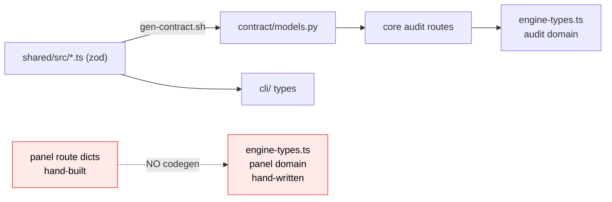

**Target** — one generated contract for every domain:

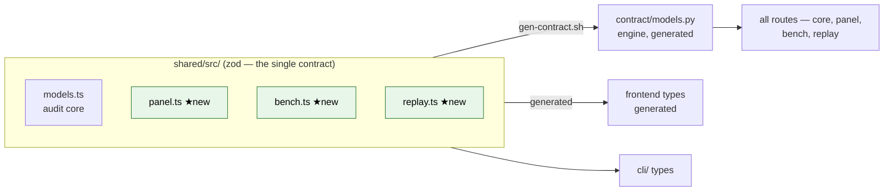

After this, divergence is not policed — it's impossible. The parity test that
exists to catch drift survives only for genuinely schema-free emissions.

---

## 6. High-level design

### 6.1 Deployment / runtime shape

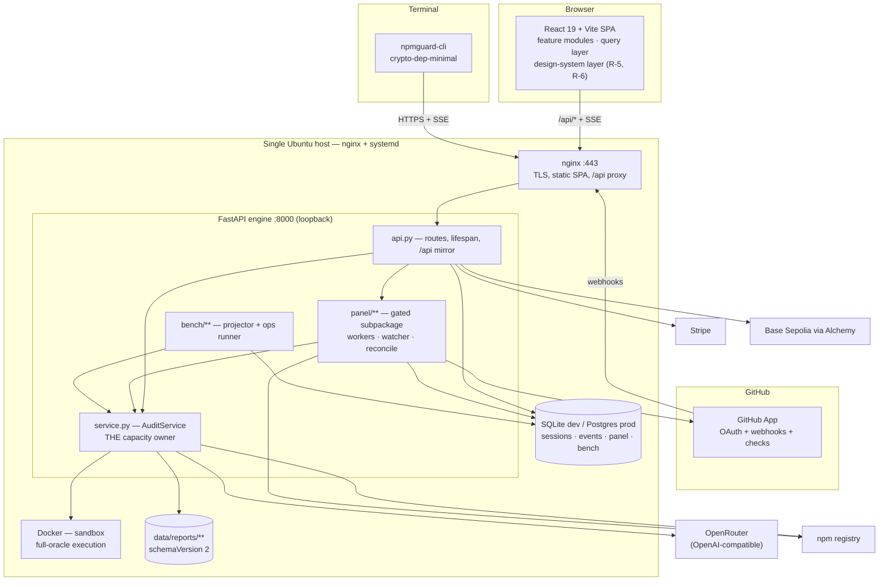

### 6.2 The panel scan flow (the "repos → packages → audits" spine)

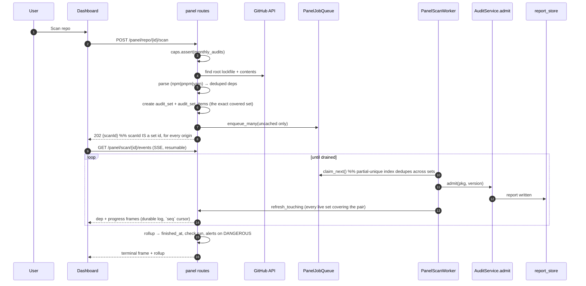

Two things this diagram is asserting on purpose:

- Progress is **recomputed from `audit_set_items` ⋈ `package_verdicts`** on every
  refresh, not incremented. A worker crash cannot desynchronize the counter
  from reality — there is no counter.
- A `repo_scan` set covers the **whole parsed lockfile**, including on a push.
  "Audit only what changed" is the cache-first enqueue, not the item list: a
  narrower item list made `repo.lastScan` — the posture the dashboard reads — a
  rollup over three items out of four hundred, and made an empty push produce a
  set with no items whose check run never concluded.
- The worker calls `admit`, so a 200-dep monorepo scan and a paid one-off audit
  compete for the *same* docker budget, with the panel's cap acting only as a
  *billing* gate, not a capacity gate.

### 6.3 Bench-v2 flow

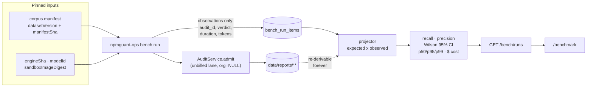

Corpus fixtures are **live malware**. The runner reads them only from inside
the sandbox; nothing is `npm install`ed on the host, nothing is committed.

### 6.4 Frontend information architecture

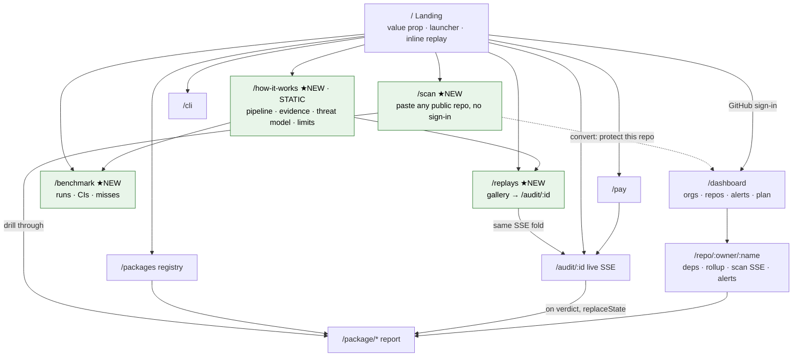

Four new surfaces, and they form a **funnel plus a credibility triangle**:

- **Funnel:** `/scan` is the no-friction entry (paste a repo, see real results),
  and its natural conversion is "protect this repo" → `/dashboard`. Nothing else
  on the site gets a stranger to a personally-relevant result that fast.
- **Credibility triangle:** `/how-it-works` says what the method *is*,
  `/replays` shows it *happening*, `/benchmark` shows what it *measures*. Claim,
  demonstration, evidence. A skeptic needs all three and today has none.

---

## 7. Phases of work

Eight phases. Each lands something usable on its own — the one exception, Phase
0, earns its place by making every later phase cheaper.

### Phase 0 — One contract, authored at its TARGET shape (N-12)

**Goal: panel and every new domain become generated, not hand-mirrored — and the
contract is written *once*, already correct.**

★ **Resequencing decision (D-5).** The obvious reading of this plan authors the
panel contract at today's shape, then rewrites it in Phase 1 (verdict collapse)
and again in R-1 (audit-set generalization). Three contract rewrites means
touching every engine route and every frontend consumer three times — which is
the exact waste N-12 exists to prevent, one level up. So:

> **Phase 0 authors the contract at its target shape**: the generalized
> `AuditSet` wire shape (R-1) and the 3-state `SAFE|ERROR|DANGEROUS` outcome
> (§4.4), both from the start. Phase 1 and R-1 then become **migrations of the
> engine and frontend to meet a contract that already exists**, not redesigns of
> it.

This inverts the usual order deliberately: normally you'd change code then
update its types. Here the contract is the *specification*, so it leads. The
practical benefit is that Phase 1 and R-1 each get a mechanical, checkable
definition of done — "the generated types compile against the engine and the
frontend" — instead of a judgement call.

Work:
- `shared/src/panel.ts` — the panel domain at target shape, reconciled against
  what the engine *actually emits* (every disagreement between the engine's dicts
  and today's `engine-types.ts` is a bug to be resolved, not copied).
- `shared/src/replay.ts`, `shared/src/bench.ts` — authored before their features
  exist, so they're never hand-mirrored at all.
- Wire into `index.ts` → `gen-contract.sh` → `contract/models.py`.
- The frontend imports from `@npmguard/shared`; the hand-written duplicates die.
- **Boundary validation:** the API layer `safeParse`s responses against the same
  schemas, so a drift fails loud at runtime instead of silently. This is the
  answer to the original (legitimate) reason `engine-types.ts` was hand-written
  "from evidence" — the fix isn't hand-writing forever, it's making the contract
  verifiable against reality.
- Acceptance is adversarial: a deliberate one-sided change must fail the build.

_Done when:_ `engine-types.ts` holds no hand-written wire shape that has a
schema; `tsc -b` + codegen are green; a one-sided change fails.

### Phase 1 — Migrate to the 3-state verdict (§4.4)
**Goal: `SAFE / ERROR / DANGEROUS` on one axis, progress on the other.**
The contract already says this after Phase 0; this phase makes the engine and
frontend *comply*. Delete `SUSPECT` (unreachable) and `UNKNOWN` (two facts under
one name); `ERROR` becomes a first-class outcome that rolls up and shows. Update
`verdict_index.SEVERITY`, `compute_rollup`, the check-run mapper, both sort
ranks, the rollup counters, the tone map.
Each deletion follows N-4: assert first, falsify independently, then delete.
_Done when:_ zero occurrences of `SUSPECT`/`UNKNOWN` as verdict values, a repo
with failed audits reports `ERROR` and not silent green, and an assert fails loud
on any other value reaching the rollup.

### Phase 2 — Panel honesty
**Goal: the dashboard never lies about what it knows.**
Remaining §1 items at their source: `lastScan` gets a real projection or is
deleted from the contract; `refresh()` surfaces named degraded states;
`connectScanStream` gets reconnect parity with `connectAuditStream`;
`panel-api.ts` goes from 0 tests to class-mapped.
Covers F-C6, F-C7, F-H10, N-3, N-4.

### Phase 3 — Panel proof
**Goal: sign-in → orgs → repos → scan → verdict → alert, proved end to end.**
Wire the existing `GitHubStub` + a seeded session cookie into the Playwright
`webServer`, then five dashboard e2e specs; plus class-mapped units for
`needsAttention`, `depPriority`/`depTone`, rollup counters.
Covers F-B*, F-C*, F-D1, F-E3, N-6, N-7, N-9.

### Phase 4 — Turn the panel on for real
**Goal: it works against actual GitHub, not a stub.**
Register the OAuth callback; tunnel webhook delivery and prove a real `push`
produces a push scan + check-run; configure billing so the upgrade path stops
being an honest 501. Covers F-B1, F-D2, F-E4, N-14. **SMTP stays out (F-D5).**

**Debt this phase inherits from Phase 3:** the alert *trigger* is the one thing
the browser tier could not drive. `PanelScanWorker` raises an alert only when a
real audit lands DANGEROUS, which needs docker + a live LLM (and under
`NPMGUARD_MOCK_LLM` a concluding audit can only be SAFE), so `panel.spec.ts` P4
fires the engine's own `handle_dangerous_verdict` from the harness process
(`panel_e2e_server.py`'s `/fixture/dangerous-fanout`) and proves the feed
downstream of it. **When an audit here can genuinely conclude DANGEROUS, delete
that endpoint and its helper and let P4 drive a real scan.** Both sites carry a
`REVISIT IN PHASE 4` marker.
_Note:_ do **not** harden the plan model here (F-E). Get *a* payment path
working behind the F-E1 seam and leave the shape changeable.

### Phase 5 — The convincer: replays + public scan
**Goal: a stranger can be persuaded in 60 seconds, without paying or signing in.**
Two features, one phase, because they share the funnel:
- **Replays (F-I):** ✅ landed. `GET /replays` over the durable audit log, rows
  linking to `/audit/:id`, and the verdict-time canonicalization suppressed so a
  permalink survives being followed. No recording step and no curated set — see
  the rewritten F-I for why that half of this plan was dropped rather than done.
- **Public scan (F-F5/F-F6):** ✅ landed. The installation requirement is gone:
  a public scan is scoped by its REQUESTER (`audit_sets.requested_by`, which also
  became the key column of `ix_audit_sets_active_public` — see D-1's note), the
  installation-scoped `publicRepoAudits` entitlement is retired, and the cost
  ceiling is per user. `/scan` is the entry surface.
  **Its lane is NOT built** and deliberately so: F-F6's "a lane that can never
  starve paid work" belongs to R-2's one durable queue (`TODO(R-2)` at the
  enqueue site in `panel/audit_set.py`), and building it here would have made it
  this repo's third queue. `public` now has a live caller. Until R-2, the bound
  is admission-side.
_Done when:_ an unauthenticated visitor can watch a real audit replay from a
permalink (**done**) and a signed-in visitor with no installation can scan a
public repo they don't own (**done**).

_Retention became a requirement here, and does not exist yet._ Promoting a
replay to a permalink means the durable log behind it must outlive it.
`kit_stream.prune` exists with **no caller**, so nothing dies today — but the
first thing to call it must exempt anything reachable from `/replays`, or a
permalink starts 404ing with no signal that it ever worked.

### Phase 6 — `/how-it-works` (static)
**Goal: the method is legible without reading the code.**
A **static** page (F-H2): no engine calls, no loading state. Pipeline stage by
stage with one frozen worked example (concrete input→output boxes, not abstract
prose), what "evidence-bound" means, the threat model, what NpmGuard does *not*
claim, and the engine version it describes.
Fully independent — no engine work, can run in parallel with anything.

### Phase 7 — Bench: rethink, then build
**Goal: decide what to measure before measuring it.**
Split deliberately in two:
- **7a · Design (paper, no code).** `METHODOLOGY.md` v2: what does detection
  even mean against a hypothesis-graph report? The v1 rule
  (`expectedCapabilities ⊆ report.capabilities` + `TEST_CONFIRMED` proofs) is
  gone. Candidate replacement: verdict match + confirmed-hypothesis presence,
  with DEFERRED as its own outcome rather than a miss. Also settle corpus size
  (see O-3) — 20 entries yields CIs too wide to publish.
- **7b · Build.** Delete `bench.py` + `/bench/results`. Build the §4.3 domain,
  the ops runner on the unbilled lane, the derived projector, `/bench/runs*`,
  then `/benchmark` (F-H8) — run picker, tiles that always carry CIs, misses as
  prominent as hits.
_Done when:_ one full run yields rates with CIs, latency percentiles, and a
dollar cost, and re-projecting from stored `audit_id`s alone reproduces them.

### Sequencing

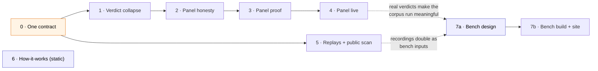

Orange = do first, it's the multiplier. Blue = parallelizable right now
(Phase 6 needs no engine work; Phase 7a is a writing task). The 0→1→2→3→4 spine
is strictly ordered. Phase 5 only needs Phase 0.

**If you want the shortest path to something demo-able:** Phase 0 → Phase 5.
That is the funnel and the convincer, and it doesn't wait on the panel strand.

---

## 8. Goals to track

Each is binary and observable — no "improve", no "polish".

**Status is as of `16426a6`, except G16 and G32 which are current.** The rest of
the table has not been re-verified since that commit and understates several
rows — check the code before trusting a ☐. ✅ = met, with the evidence named in the last
column; ◐ = partly met, with what is missing stated; ☐ = not started or not
verified. A goal is only ✅ when something *fails* if it regresses — a passing
grep today is not evidence, so the column names the test or the deletion that
enforces it. Where a goal was **overtaken** by a design change rather than
implemented, that is said explicitly: the goal text, not the code, is what
needs correcting.

| # | Goal | Phase | Status | Verified by / what is missing |
|---|---|---|---|---|
| G1 | Panel wire shapes are generated from `shared/`, not hand-mirrored | 0 | ✅ | Schemas authored at target shape (`0988bd7`, 79 → 137 → 152 definitions) and `contract.schema.json` + `contract/models.py` are generated from `shared/`. The migration is finished on **both** sides: `frontend/src/lib/engine-types.ts` is **deleted**, not emptied — its last residents were the audit routes' HTTP envelopes, now `shared/src/audit-api.ts` — and the engine builds those responses from the generated models through `api.py::_wire` instead of dict literals, so no shape has two authors. Enforced, per this table's own bar, by three things that *fail*: the file's deletion (a re-import does not compile), `api.test.ts` C6 (each envelope's response is `safeParse`d, so a one-sided engine change throws `ContractViolationError` rather than reaching a component as `undefined`), and `test_contract_wire.py` C7, the codegen-freshness guard that re-renders the zod to a tmpdir and diffs — closing the last silent path, where a `shared/src` edit that skipped `gen-contract.sh` left every consumer agreeing with each other about the old shape. Two dead branches went with it: `CryptoConfig.auditFeeWei` is non-nullable (the engine retracts the whole `crypto` block when it cannot read the fee), and `CheckoutStatus.auditId` is `null`-always-present rather than sometimes-absent. |
| G2 | `bench` + `replay` schemas exist in `shared/` before their features do | 0 | ✅ | `shared/src/bench.ts` and `shared/src/replay.ts` exist at `1002b5b`; both predate their features, and neither has a hand-written mirror. |
| G3 | Zero `SUSPECT`/`UNKNOWN` as verdict values anywhere | 1 | ✅ **now, and the earlier ✅ rested on a false claim** | `d1c4cd7` collapsed the domain, and no `SUSPECT`/`UNKNOWN` **verdict** producer exists in `engine/`, `shared/` or `frontend/src/`; surviving hits are comments recording the deletion, plus the unrelated `Confidence` enum (`SUSPECTED`), itself dead — see G31. **But `d1c4cd7`'s stated justification, "`SUSPECT` had zero producers anywhere", was false**, and `a72f1af` establishes the sharper version: a producer exists in *another lineage* (`origin/main`'s TypeScript `proof-quality.ts`, upserted by `verdict-index.ts` with no filter and no CHECK), and worse, its `report-store.ts` ran every report through a normalizer that **overwrote the stored verdict** — so the report **file** on disk carries `SUSPECT`. `data/reports/` is shared, and this checkout still holds a `schemaVersion`-1 file written by that lineage. The leak reproduced through `list_reports` **and** `load_report`, and through a public route the earlier audit never named — `/package/{name}/report`, which returns the whole report dict. Now closed at the **read boundary** rather than per route: one domain predicate at `report_store`'s only two doors out of `data/reports/`, **derived from the generated contract** rather than restated, so it cannot drift from the enum and a legitimate widening needs no edit. `api.py` needed no change at all, which is the point — a future route inherits the rule without knowing it exists. Plus durable enforcement: a `CHECK (verdict IN ('SAFE','DANGEROUS'))` on `package_verdicts.verdict`, in both the table definition (`tables.py:246`) and migration `0007`. |
| G4 | `ERROR` is a real rollup outcome — failed audits never render as green | 1 | ✅ | `d1c4cd7`. `compute_rollup` asserts the partition (`safe + dangerous + error + pending == total`) and the progress refreshers derive their counters from it, so they cannot disagree with the wire. The falsification pass also found the **real silent green** this was aimed at: `panel.py` rolled up the repo-wide dep index and reported it as *the scan's* verdict, so a delta scan whose only item was DANGEROUS or ERROR returned SAFE. |
| G5 | Every branch deleted in Phase 1 is covered by a loud assert | 1 | ◐ **goal text is wrong** | The intent is met; the goal as *worded* is not achievable and should be reworded. `d1c4cd7`'s falsification pass **refuted two of the proposed invariants**: "not concluded ⇒ a live job XOR a terminal failed job" is false on three reachable paths, and "the guarded finalize UPDATE always matches the row it read" is false under Postgres READ COMMITTED. Both had been written as asserts; either would have 500'd a live panel route on real data. They are explained branches, not asserts — which is the method working, not a gap. Reword to "every deleted branch is either asserted unreachable or has a recorded falsification". |
| G6 | No panel sub-fetch failure renders a confident view | 2 | ✅ **structurally** | Two independent mechanisms. `4aebcd2` enforced the empty/degraded distinction at the **type** level: `ReadSucceeded` is branded with a module-private symbol, `LoadState`'s failed arm has no `data` field at all — not `[]`, not `null` — so `catch { setItems([]) }` has nothing to reach for, and weakening the brand fails **typecheck**, pinned by `@ts-expect-error`. Then R-5 removed the thing that made the bug possible: `panelStore.refresh()`'s five-way `Promise.allSettled` with hand-written per-branch fallbacks is gone, server state moved to react-query, and each query carries its own status so a partial fetch cannot render as a confident view. The goal's original form — "a unit test per degraded path in `panelStore`" — is now unsatisfiable in the good way: there are no degraded paths in `panelStore` because there is no server state in it. |
| G7 | `lastScan` is projected for real or deleted from the contract | 2 | ✅ | `9999648`. Both hardcoded `None`s are gone; `lastScan` is populated at `panel.py:282-288` (list, batched via `latest_set_rows`) and `panel.py:604` (detail). |
| G8 | `connectScanStream` reconnects with backoff, at parity with the audit stream | 2 | ✅ **by deletion** | `9999648` deleted the polling scan stream and the client-side report poll outright, replacing them with the durable log + `seq` cursor the audit stream already uses. Parity is now structural — there is one stream mechanism, not two. |
| G9 | `panel-api.ts` has a class map and tests | 2 | ◐ **goal is stale; restate it** | `frontend/src/lib/panel-api.ts` was **deleted** in `0965319` and its job split by R-5 into `frontend/src/features/*/{api,hooks,keys}.ts`. The response-class knowledge it was meant to carry now lives at the call sites as schema parses rather than structural sniffs (e.g. `features/repos/api.ts:93-117` names the 409 as `ScanAlreadyRunning`), and `features/repos/hooks.test.tsx` plus `lib/query-client.test.tsx` cover the transport. Restate the goal against the feature modules; there is no single file left to hold a class map. |
| G10 | 5 dashboard e2e specs green against a real engine | 3 | ✅ | `frontend/e2e/panel.spec.ts` — six scenarios (P1 sign-in/workspace mirror, P2 scan → live progress → a rollup that partitions its deps, P3 posture across card+rail+filter, P4 the alert feed and its ack, P5 drill-through to the durable report, P6 Protect kicking the first scan) in a real chromium against the real engine with the panel ON. What made it possible: `engine/tests/support/panel_e2e_server.py` runs the Python tier's `GitHubStub` as a **process** (plus a slow-404 npm registry that makes a cache-MISS dep deterministic in both outcome and duration), and `playwright.config.ts` boots it as a third `webServer` with the five App credentials. The fixture — durable reports + the GitHub scenario — is one file (`e2e/panel-fixture.ts`) applied at **config load**, because Playwright starts webServers before `globalSetup` and the verdict index is rebuilt from `data/reports/` only at engine boot. **The tier immediately paid for itself:** it found that `/panel/repos` answered `{"repos": []}` — a confident empty — on a first sign-in, because it read the `user_installations` mirror that only `/panel/orgs` writes and the dashboard fires both queries concurrently. Every Python test called the two in sequence, which is why nine months of green integration tests never saw it. Fixed by making both routes read GitHub through `_sync_user_installations`; pinned at both tiers (`tests/e2e/test_panel_repos.py` R1, and P1), and both go red when the fix is reverted. |
| G11 | Panel classification logic is class-mapped and unit-tested | 3 | ✅ **restated against `features/*`** | `tone.tsx` (outcome→tone, dep priority) keeps its map in `tone.test.ts`. The repo-level half is now `features/repos/posture.ts` with `posture.test.ts` (R1–R8): `needsAttention`, `repoBucket`, `portfolioCounts`, and the filter chip counts+predicate, extracted out of `Dashboard.tsx` and `PortfolioPosture.tsx`. The goal's original wording predates R-5's feature-module split, so it is restated against `features/*` rather than the file names it named. Two facts the extraction made statable instead of implicit: the four portfolio buckets **partition** the repo list (R5 — the rail is a proportion, not four filters that happen to add up), and `needsAttention` and `repoBucket` **deliberately disagree** on a still-running set with a DANGEROUS partial rollup (R2/R3): the filter says a human is needed now, the rail says the proportion is not settled. That divergence was previously invisible in two inline copies. |
| G12 | Real GitHub OAuth round-trip completes | 4 | ☐ | Manual, not yet done. |
| G13 | A real `push` to a real protected repo produces a push scan + check-run | 4 | ☐ | Not verified against a real repo. Note `9999648` changed the semantics being verified: `delta_repo_scan` became `push_repo_scan` covering the whole pushed lockfile, so an empty-delta push now concludes its check run instead of spinning forever. |
| G14 | *A* payment path closes end to end, behind the F-E1 seam | 4 | ☐ | Not started. |
| G15 | No table/wire/component encodes plan as a two-valued fact | 4 | ☐ | Not verified. |
| G16 | Every finished audit is browsable and permalinked | 5 | ✅ | **Goal restated, and the restatement is the result.** It read "≥3 curated replays, browsable, permalinked, contract-pinned" — three clauses that only existed because replays were assumed to be authored artifacts. `GET /replays` projects `audit_sessions`, rows link to `/audit/:id`, and `App.tsx` no longer canonicalizes a followed permalink away (that bug would have silently repointed every link this goal asks for). Count is now a consequence of use, not a target; pinning is moot with nothing authored to pin — see the rewritten F-I. `engine/tests/test_replays.py` C1–C9 (7 of 13 fail against the pre-fix build), `frontend/src/pages/Replays.test.tsx` R1–R5. |
| G17 | A visitor whose only credential is a GitHub sign-in can scan a public repo they don't own | 5 | ✅ | **Goal restated to match D-1**, which decided a sign-in is required and nothing more — "unauthenticated" was the pre-D-1 wording and is not what the product does. The route no longer takes an `installationId`; read authorization on the snapshot, the history and the SSE stream all run through `audit_sets.requested_by` instead of `user_installations`. `engine/tests/e2e/test_panel_public_billing.py::test_s_pub_0` is the falsifiable form: it signs in and never calls `/panel/orgs`, so `user_installations` is empty, and it asserts that precondition before scanning — every assertion in it fails on the pre-fix route (400 without an installation id, 404 on one the user lacks). |
| G18 | Public scan has a cost ceiling that isn't a login | 5 | ✅ | A scan's cost is exactly its cache MISSES, so F-F6's dep cap and its cached-only-past-the-cap are one number: `public_limits.PublicScanLimits.new_audit_budget` (per-scan ∧ per-month, per USER), spent through `AuditSetSpec.max_new_audits`. Past it a scan covers less of the lockfile rather than being refused, and `public_repo_scans.dep_count` + `PublicRepo.lockfileDepCount` are what let the result say so — uncovered deps are NOT parked in the set as unenqueued items, because `item_outcome` maps "no verdict, no live job" to ERROR and would report each as an audit that failed. The one refusal is 429 on per-user live-scan concurrency. `engine/tests/test_panel_public_limits.py` C1–C15, `frontend/src/features/honest-states.test.tsx` H7. Note "abuse ceiling" → **cost** ceiling: D-1 makes the sign-in the abuse ceiling, so there is no IP rate limit and no captcha by decision. |
| G19 | `/how-it-works` ships as a static page with zero engine calls | 6 | ☐ | Not started. |
| G20 | `METHODOLOGY.md` v2 defines detection against a v2 report | 7a | ✅ | `bench/METHODOLOGY-V2-DRAFT.md` (`557c65d`, corrected by `0965319`). Owned elsewhere; not re-reviewed in this pass. |
| G21 | Corpus size decision made and justified | 7a | ✅ | O-2/O-3 answered in the methodology draft (`557c65d`). |
| G22 | `bench.py` + `/bench/results` deleted; no v1-field reader remains | 7b | ✅ | `16426a6` deleted `engine/npmguard/bench.py`, the `/bench/results` route, the v1 TypeScript runner and its types, and the stale v1 methodology. Worth recording *why* v1 was deleted rather than ported: its detection rule (`expectedCapabilities ⊆ report.capabilities` plus `TEST_CONFIRMED` proofs) was not merely meaningless against a v2 report — it was **already vacuous**, because its own fixtures carry `expected.capabilities: []`, so `verified` was **0/20 by construction**. Its Wilson CI also pooled entries × runs, which is pseudo-replication. A benchmark that cannot fail is worse than no benchmark. |
| G23 | One full run yields rates with CIs, latency percentiles, dollar cost | 7b | ☐ | Not started. |
| G24 | Bench metrics re-derivable from stored `audit_id`s alone, **reading `audit_sessions.report` not `report_store`** | 7b | ◐ **the trap is now structural** | `16426a6` builds bench v2 **on** `audit_sets` rather than beside it — a bench run *is* an audit set whose `origin` is `bench_run` — which is the payoff R-1 was for. Metrics read `audit_sessions.report` keyed by `audit_id`, never `data/reports/<pkg>/<version>.json`, precisely because the filesystem store keeps only the **last** audit of a `(name, version)`, so an N-repeat entry would silently collapse to one report. Two independent reasons that store is unsound as a re-projection base — this one, and §21.3 asymmetry 5 (a completed audit with no concrete version never reaches it at all). Not ✅ until a full run is projected and compared. |
| G25 | `/benchmark` renders a real run, misses as prominent as hits | 7b | ☐ | Not started. |
| G26 | `ruff check` + `pytest` + `vitest` + `playwright` all green | all | ◐ | Engine green and rising: 669 passed / 3 skipped / 1 xfailed at `0d73449`, 77 e2e at `1002b5b`. `4aebcd2` also fixed `npm run typecheck`, which had **never once run to completion** — `tsc -b --noEmit` contradicts `shared/` being a composite project reference and failed with TS6310. Not ✅: no `playwright` suite exists. (The frontend build broke for two commits mid-rename and was restored by R-5 at `10a288a` — see the note below.) Engine at `10a288a`: 727 passed / 3 skipped / 1 xfailed. |
| G27 | Engine tests stay hermetic (no `.env` read, panel off by default) | all | ✅ | `conftest` assert, unchanged through this run of commits. |
| G28 | A rendered timeline shows the authority the package actually requested, port included | §24 | ✅ | `ced29f2`. `test_instrumentation_l4.py` runs the real instrument under real node — the defect was unreachable from Python unit tests. Asserts a non-default port renders and that a default port is **not** invented. Explainer §24.7. |
| G29 | A planted canary appearing in an exfiltrated body is citable by the judge | §24 | ◐ | `ced29f2`. Request bodies are captured (2 KiB/request, 64 KiB/run) with `bodyBytes` making truncation visible, and the renderer names which `setupApplied.env` canary the body or URL carries, with an 8-character floor so `CI=1` cannot be cited. **Missing:** planted **file** contents are stored as hashes only, so a *file* canary is still unmatchable. Explainer §24.8. |
| G30 | No report implies a region was tested when no experiment covering it ran | §24 | ✅ | `ced29f2`. `add_or_merge` merges only on description similarity **and** a byte-identical `experiment` **and** an identical `claim`, so the invariant holds by construction with no new state. `test_graph.py`. Explainer §24.17. |
| G31 | No declared value in the wire vocabulary lacks a producer | §24 | ◐ **two known counterexamples** | Error codes and config keys are ✅ and *mechanically enforced*: `test_error_taxonomy.py` reads construction sites with `ast` (not grep), and `test_config_surface.py` now enforces the config surface in **both** directions (`37a6343`) — every declared setting has a reader (C1) *and* every `NPMGUARD_*` production code reads is declared (C3), with two named-debt exemptions each carrying its one-line swap, plus a test that deletes an exemption when its read goes. C4 also scans environment **access sites** with `ast` rather than string literals, because a literal scan cannot tell a read from a write — the engine legitimately *writes* two variables into the sandbox container, and declaring those would assert the opposite of the truth. **Still open:** (a) `Trigger.kind` accepts `lifecycle` and `bin` which `build_trigger_command` cannot run, and `LifecycleHook` has no producer at all — explainer §24.19; (b) `Finding`, `Proof`, `Confidence` and `TriageResult` in `shared/src/models.ts` have **zero** producers and readers repo-wide yet are regenerated into `contract/models.py` and `contract.schema.json` on every build — explainer §24.21. The goal's own "grep per enum" is what catches (b). |
| G32 | Every replay is a real capture, and derived fields equal what the engine computes | 5 | ◐ **scope narrowed** | **The `/replays` gallery satisfies this by construction and is out of its scope from here on:** it replays the frames the engine emitted and reads every field back off the audit row, so there is no derived field that *could* disagree. What remains under this goal is the two committed recordings in `engine/demo-data/`, which still serve Landing and e2e. For those: `0d73449` built the mechanism for the committed demo recording: every curated value is now pinned by a test that computes engine truth **from engine code** — `classify_files` over the fixture tree for `fileType`/`permissions`, the real `provision_dependencies` for the dependency claim, `SEVERITY_SCORE` over the recording's own severities for `riskContribution` — with each docstring saying to delete the test on re-record, so a re-record turns red instead of letting a curated value rot into a specification. **Not ✅:** the recording itself is still a hybrid and still diverges on `fileType`, `permissions`, `riskContribution`, `expectedCapabilities`, `trace[].input/output` and `durationMs`. Explainer §24.1, §24.2. |

**Two things the status above surfaces that are not goals yet.**

1. **A two-commit window where the frontend did not build — worth recording as a
   process fact, not a defect.** `0965319` deleted
   `frontend/src/lib/panel-api.ts` while five modules still imported it
   (`components/Header.tsx:4`, `pages/Dashboard.tsx:17`,
   `pages/RepoDetail.tsx:29`, `stores/panelStore.ts:26`, and
   `features/repos/components/PublicAuditReportDialog.tsx:15`, the last from a
   directory one level deeper than its relative path assumed). **R-5 resolved it by
   `10a288a`** — no `panel-api` import remains. The reason to keep this: a
   contract-reconciliation doc verified against a commit inside that window
   reported a build failure that was neither a finding nor a regression, which is a
   real hazard when several agents land large renames in sequence. G26's frontend
   half is evaluable again.
2. **A deleted test was not recorded as deleted.** `0d73449`
   ("tests: cover the dealbreaker path and DemoService") also deleted all 285
   lines of `frontend/src/stores/panelStore.test.ts` without mentioning it in its
   commit message. The B11 finding that file carried had just been *fixed* in
   `d1c4cd7`, so the coverage was live when it disappeared. Worth a goal of its
   own: a commit that deletes a test file says so.

---

## 8b. Architectural rework — the breaking changes, now not later

Backwards compatibility is explicitly not a constraint. So here is what I'd
break, worst-first by leverage. Each is a *structural* finding: it deletes a
class of work, not an instance.

### R-1 ★ Three copies of "a set of packages to audit, plus a rollup"

The single strongest finding in the review. Compare:

| | `scans` | `public_repo_scans` | planned `bench_runs` |
|---|---|---|---|
| status, total, cached, audited, failed, error | ✔ | ✔ | ✔ |
| started_at, finished_at, commit_sha | ✔ | ✔ | ✔ |
| items table `(scan_id, name, version, cached)` | ✔ | ✔ (+direct, +range) | ✔ |
| progress recomputed from items | ✔ | ✔ | ✔ |
| severity rollup over item verdicts | ✔ | ✔ | (different scoring) |
| SSE progress stream | ✔ | (polled) | — |

Three near-identical entities, **two** rollup implementations, **two** progress
refreshers, and a third copy about to be written. And a dep-tree audit (below)
would be a **fourth**.

They are all one thing: **an audit set** — a named collection of
`(name, version)` to be audited, with progress and a rollup over the results.
The only real difference is *how the item list is discovered* and *who is
billed*.

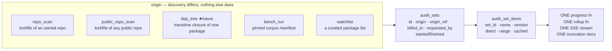

**Why this is the right generalization and not premature abstraction:** it isn't
speculative — three concrete instances already exist and two more are on the
roadmap. The abstraction is *discovered*, not invented. And it collapses
`(instances × mechanisms)` into `(instances + mechanisms)`: today, adding
dep-trees means writing progress + rollup + streaming + truncation a fourth
time; after, it means writing one item-discovery function.

**What breaks:** the panel's table names and both wire shapes, `compute_rollup`'s
signature, the public-scan detail route. All of it is behind Phase 0's generated
contract, so it's a schema edit plus a migration — not a hunt.

**Do this before Phase 7b**, or bench becomes the third copy and you'll be
generalizing three implementations instead of two.

### R-2 ★ Two queues solving the same problem; the core has the weaker one

- `PanelJobQueue` — **DB-backed**: `claim_next()` with a durable `state`
  machine, a partial-unique index for dedupe, `reset_stale()` for orphan
  recovery. Multi-process safe **today**.
- `AuditService` — **in-process**: an `asyncio.Queue`, a `_pending: dict[str,
  Future]` ownership map, and a fixed worker pool sized by `max_concurrent`.

The docstring is precise about what it guarantees: *"`status == running` iff an
owned worker task will finalize the row"*. **"Owned" means owned by this
process.** So the "single capacity owner" invariant — the thing §0 calls the
spine — is a **single-process** invariant. Two engine processes means two
`_pending` maps, two worker pools, two Docker budgets, and no global cap. The
durable *admission count* is already DB-backed (`reserve()` →
`queued_count()`), which is the good half; *ownership* and *concurrency* are not.

Note the current shape is a queue in front of a queue: a panel scan enqueues
into `panel_jobs`, a panel worker claims it, and then calls `admit()` which
enqueues into `AuditService`'s in-memory queue behind a second worker pool. Two
hops, two backpressure models, one job.

**The move:** the core adopts the panel's pattern — a durable claim with a
**lease** (`claimed_by`, `lease_expires_at`), heartbeat renewal, and expiry
reclaim. `_pending` disappears (ownership is a DB fact, not a process fact).
Concurrency becomes *per-node* (each node's Docker cap) under *global* admission
(the durable queue). `PanelJobQueue` then folds into it — the panel stops
needing its own queue at all, because the core queue already has lanes,
dedupe, and durable state.

**Scope — D-2, decided: seam + fold `PanelJobQueue` in.** Build the durable
claim + lease + per-node concurrency, *and* collapse the two queues into one with
lanes (`paid | panel | watch | bench | public`). `panel_jobs` and the panel
worker pool are deleted; the core queue already has to grow lanes, dedupe, and
durable state to do the job, so a second implementation of all three earns
nothing. Jobs go from two hops to one.

Still **one node** — actual distribution (shared report storage per R-3, node
registry, work stealing) waits. What must not wait is the *interface*, because
retrofitting ownership out of a process-local dict later is a rewrite.

**What makes the fold safe rather than reckless:** the panel's queue is the
*better* implementation, so this is the core adopting the panel's semantics, not
the panel losing anything. The migration direction matters — lift `claim_next`,
the partial-unique dedupe index, and `reset_stale` up to serve both, then move
the panel's callers over, then delete. At no point does a proven path run on
unproven code.

**Risk flag:** this touches the payment trust boundary (exact-once claims, "never
launch work before the proof is verified and claimed") and the restart-recovery
invariants hardened in `07f46fd` / `5eedc19`. It gets the full N-4 treatment —
assert, independently falsify, then delete — and its own e2e tier, or it doesn't
get done.

### R-3 · Reports live on one machine's filesystem

`data/reports/<pkg>/<version>.json`, `audit-logs/`, and the artifact store are
all local FS. Two nodes ⇒ node B can't read node A's reports, and
`package_verdicts` (the rebuildable index) would rebuild differently per node.

`CLAUDE.md` forbids IPFS / ENS / external **pinning** and mandates
`report_store.py` as the single source of truth. Object storage behind that same
interface honours both: `report_store` stays the one seam, the backend becomes
swappable, and no external pinning service enters the picture. Alternative:
reports as JSONB in the DB with the FS as a read cache — fewer moving parts,
and the DB is already the durability story for sessions and events.

Cheap now (it's one module's internals), expensive later (every consumer that
learned the path shape).

### R-4 · Event fan-out is already right — copy it

`kit_spine.notify_postgres` is LISTEN/NOTIFY with events in the DB, an explicit
reconnect-and-wake-everyone story, and NOTIFY carrying no payload ("a wake means
*check the database*"). That is exactly the correct design for cross-process
streaming, and it already exists. **No work needed** — but it's the model R-2
should imitate rather than invent something new.

### R-5 ★ The frontend has one god store doing four jobs — **DONE (`10a288a`)**

> **Landed.** `panelStore.ts` is now **50 lines of pure UI state** — the one fact
> that outlives a component tree (an open paywall, set by a mutation that 402'd and
> read by a dialog rendered from two different pages, so neither end owns it).
> Server state moved to `@tanstack/react-query` under
> `frontend/src/features/*/{api,hooks,keys}.ts`. The file now carries an explicit
> bar for re-entry — a field must be UI state *and* needed by two components that
> are not each other's ancestor — plus a named list of what must not come back and
> why. This closes **G6** structurally (see §8) and makes **G9** unsatisfiable as
> worded, since there is no single api module left to hold a class map.

`panelStore.ts` **used to own**: server fetching, response caching, staleness and
polling, error policy, optimistic updates, *and* UI state (`paywall`,
`billingBusyInstallationId`, `repoActionErrors`). That is why `refresh()` grew a
five-way `Promise.allSettled` with hand-written per-branch fallbacks — the store
was hand-rolling a cache layer.

The reference repos all refuse this, in the same way:

| Repo | Server state | UI state | Layout |
|---|---|---|---|
| supabase/studio | react-query hooks per resource, query-key factories | small local/zustand | feature folders + `data/` layer |
| plane | service class per resource | MobX stores per domain | strict page → component → store → service |
| twenty | generated hooks | atom-ish per module | `modules/<domain>/{components,hooks,states,utils}` |
| vercel/chatbot | server-first, minimal client cache | almost none | app-router colocation |

The shared pattern worth stealing — and the one npmguard is missing:

1. **Server state is not application state.** A query library (TanStack Query)
   owns caching, refetch, dedupe, polling, staleness, and retry. Every one of
   those is hand-written in `panelStore` today, and the degraded-state bug in §1
   is a direct consequence: a cache layer has a *per-query* status, so "alerts
   failed while repos succeeded" is representable by construction instead of
   needing a bespoke `billingError`-style field per resource.
2. **Zustand shrinks to genuine UI state** — dialogs open, paywall visible,
   which row is busy. Tens of lines, not hundreds.
3. **Feature modules over type folders.** Today: `components/panel/`, `stores/`,
   `lib/` (type-first). Target: `features/{repos,alerts,billing,replays,bench}/
   {components,api,hooks}` — the thing you change lives in one directory.
4. **Generated types at the boundary** — already converged, that's Phase 0.

This also pre-empts a real risk: Phases 5–7 add four new surfaces (replays,
public scan, how-it-works, benchmark). Adding them to a god-store architecture
means four more `refresh()`-shaped functions with four more bespoke degraded
states. Restructure *before* multiplying.

**Split R-5 in two, because only half of it waits on the redesign (D-3):**

| | Gated on the visual redesign? | Can start after Phase 0? |
|---|---|---|
| **R-5a · data layer** — query layer, feature-module folders, store shrink, msw per module | **No** — it's all behaviour and types | **Yes** |
| **R-5b · component layer** — design-system layer, vendored Radix components, token authoring, page recomposition | **Yes** — needs the design phase | No |

This matters: R-5a is the half that fixes the §1 degraded-state bug (per-query
status makes "alerts failed while repos succeeded" representable by
construction), and it would otherwise sit idle behind a taste decision it has no
dependency on. Do R-5a as soon as Phase 0 lands; let R-5b follow the design pass.

### R-6 ★ Frontend styling substrate — rebuild it, don't defend it

**`frontend/CLAUDE.md`'s "plain CSS, no Tailwind, light-only" is not a
constraint of this design.** It's a record of a past choice, and it does not get
a vote against quality. Judged on merit and nothing else:

What's actually wrong with the current substrate — the *substrate*, not the
visual design:

1. **CSS classes are not a component contract.** `base.css` has tokens and
   primitives, which is the right *idea*, but a primitive expressed only as a
   class name can't carry behaviour, state, or types. `PanelDialog` is a bespoke
   dialog: hand-rolled focus trap, hand-rolled escape handling, hand-rolled
   portal, hand-rolled ARIA. Every one of those is a place to be subtly,
   invisibly wrong — and "subtly wrong accessibility" is the exact failure mode
   nobody notices until a user can't operate the app.
2. **Eight page sheets re-derive layout.** `audit|report|landing|registry|pay|cli|panel|base.css`,
   one per page, each composing primitives by hand. Four new surfaces (Phases
   5–7) means four more sheets. That is the CSS analogue of R-5's god store:
   the pattern doesn't scale with surface count.
3. **Light-only is a product limitation dressed as a design principle.**
   Theme-aware is table stakes for a developer tool in 2026.

What the reference repos actually do — and the pattern is *not* "Tailwind":

| Repo | Substrate | Design-system layer |
|---|---|---|
| supabase/studio | Tailwind | shared `ui` package over Radix |
| plane | Tailwind | `@plane/ui` package |
| twenty | **emotion / styled-components + theme** | `ui/` module, theme-driven |
| vercel/chatbot | Tailwind | shadcn/ui, vendored |

Three of four use Tailwind; **four of four have a separate design-system layer
with tokens, and pages compose that layer.** The layer is the pattern. The
utility-class engine is an implementation detail of it.

**Decided (D-3): Tailwind v4 + shadcn-vendored Radix + a project design-system
layer, and the visual language is being redesigned — not ported.** So this splits
into a design phase and a build phase, and the design phase is a *taste* task
that gates only the component layer (see R-5's split below).

The reasoning for the substrate, in order of weight:

- **shadcn is a vendoring pattern, not a dependency.** Components are copied
  *into* the repo and owned outright — auditable, editable, no black box. For a
  security product that is strictly better than importing an opaque component
  library, and it's the same ownership model the current hand-written components
  have, minus the bugs.
- **Radix gets accessibility right** in ways hand-rolled dialogs and dropdowns
  reliably don't.
- **Tailwind v4 is CSS-first.** `@theme` holds real design tokens as custom
  properties, so the token layer gets a *schema* instead of being convention.
  Since the look is being redesigned, tokens are **authored fresh** rather than
  ported — which makes this the right moment, because a redesign that lands on
  hand-written sheets would have to be redone.
- **Theme-aware from the start**, killing the light-only limitation. Designing
  light-and-dark up front is far cheaper than retrofitting dark onto a palette
  chosen for light.
- **The code-design patterns from all four repos transfer directly**, which is
  the whole reason for looking at them.

`animate-ui` composes cleanly once Tailwind is in — treat it as an optional
source of motion patterns during the design phase, not an architectural
decision.

**Because the look is open (D-3), the design phase comes first and is a real
deliverable, not a preamble:** references, palette (light + dark), type scale,
spacing rhythm, elevation, motion vocabulary, and the component inventory the
product actually needs (dialog, dropdown, table, tabs, toast, meter, feed,
verdict pill, phase rail, dep row). Authored as tokens + a component contract
list, so the build phase is mechanical. Skipping straight to code here is the
one place in this plan where speed would cost the most, because every page
composes these decisions.

**`frontend/CLAUDE.md` gets rewritten as part of this work**, not cited by it.

### R-7 · Whole-dependency-tree audits (future, designed for now)

The user's stated future direction. Two observations:

1. **After R-1 it's nearly free** — a dep-tree audit is an `audit_set` whose
   origin is `dep_tree` and whose item discovery is "resolve the transitive
   closure of one package". Progress, rollup, streaming, and truncation are
   inherited. Without R-1 it's a fourth reimplementation.
2. **It is primarily a cost-explosion problem, not a mechanism problem.** One
   package with 800 transitive deps is 800 audits. That needs: depth bounds,
   cached-first expansion, "audit leaves upward" ordering (per the existing
   direction), a per-set budget ceiling, and a rollup that distinguishes *"this
   package is dangerous"* from *"something in its tree is dangerous"* — which is
   a **new outcome dimension**, not a new verdict value. Worth designing before
   building, and worth NOT building until the audit-set generalization lands.

### Sequencing the rework against the phases

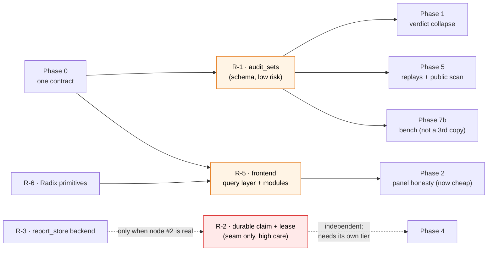

Orange = do early, cheap, high leverage. Red = high care, needs its own proof
tier. Two reworks are near-free *if done before* the phases that would multiply
them (R-1 before bench; R-5 before four new surfaces) and expensive after.

### Testing discipline across the rework

Both TESTING.md documents already define the two pillars (class-mapped blackbox
units + e2e against real boundaries). The rework needs the **middle tier named
explicitly**, because it's where all of this actually gets proved:

| Tier | Boundary | Exists? |
|---|---|---|
| Unit | one exported fn/class, class-mapped | ✔ both sides |
| **Integration** | route ⇄ real DB ⇄ stubbed external (GitHub/Stripe/registry) | **partly** — `-m e2e test_panel_*` is really this |
| E2e | real browser ⇄ real vite ⇄ real engine ⇄ real DB | ✔ audit; ✗ dashboard |
| Contract/parity | generated ⇄ emitted | ✔ core; ✗ panel (Phase 0 fixes) |

Specifically: R-1's rollup and progress functions are pure ⇒ **unit**, with one
class per origin. R-2's claim/lease is a concurrency invariant ⇒ **integration
against real Postgres** (single-connection SQLite cannot prove it; the gate
already provisions a throwaway PG for exactly this). R-5's query layer ⇒ msw
integration per feature module. Nothing here is provable by unit tests alone,
which is why the tier gets a name.

---

## 8c. Decisions made

| # | Decision | Consequence |
|---|---|---|
| **D-1** | Public repo scan requires a **GitHub sign-in**, but no App install, no ownership, no installation charged | F-F5/F-F6 rewritten. The sign-in *is* the abuse ceiling, so no IP rate-limiting layer; what remains is **cost** control (dep cap, per-user concurrency, non-starving lane). Simpler than the anonymous design. |
| **D-2** | R-2 goes **seam + fold `PanelJobQueue` in** | One durable queue with lanes (`paid\|panel\|watch\|bench\|public`); `panel_jobs` + the panel worker pool deleted; two hops → one. Migration direction is *lift the panel's primitives up, move callers, then delete* — a proven path never runs on unproven code. |
| **D-3** | Frontend substrate rebuilt **and the visual language redesigned** | Tokens authored fresh, not ported. Adds a design phase as a real deliverable (palette light+dark, type scale, spacing, elevation, motion, component inventory). Splits R-5 into **R-5a data layer** (not gated) and **R-5b component layer** (gated on the design). |
| **D-4** | Start with **Phase 0** — one contract | Panel/bench/replay schemas into `shared/`, generated both sides. Everything downstream gets cheaper; R-1's table collapse becomes a schema edit rather than a hunt. |
| **D-8** | **O-8 answered — no serif.** None of the surveyed dev-tool landing pages use one, and that survey *is* the evidence; overriding it would be taste against data. The brief's type system collapses to sans (interface) + mono (machine-authored fact), which also sharpens the mono signal by removing a third voice competing with it. | Simplifies R-6a's type scale and drops a webfont from the boot path. |
| **D-6** | **O-2 answered** — 8-value observation taxonomy, derived at read time. `ERROR` splits into **`ABSTAINED`** (the engine's own honest "couldn't determine" — stays in the denominator) and **`VOID`** (Docker/LLM/queue fault — excluded from rates but counted and reported), keyed on the stable `NpmGuardError` codes. `verified` splits too: a `DANGEROUS` verdict with `confirmedCount == 0` is not weakly-proved, it is a **dealbreaker** (`pipeline.py:275-288`) — a disjoint mechanism that produces zero hypotheses. | The design doc's own candidate was wrong in one place: "give DEFERRED its own outcome bucket" is **unreachable**. `pipeline.py:436-444` raises `AuditIncompleteError` when hypotheses are deferred and none confirmed, so a report with deferred-but-nothing-confirmed **does not exist**; the observable is no report at all. 3 projector assertions guard the states the engine makes unreachable. |
| **D-7** | **O-3 answered** — expand to **50 malware + 75 negative controls at N=2**, plus a 10-entry N=5 stability probe (~280 audits). Minimum viable tier 40+40. | Rests on a **statistical error in v1 worth more than the schema fix**: v1 §8 pools entries×runs to n=60 and puts a Wilson CI on that — pseudo-replication, narrowing the interval ~40% on a false independence assumption. With n = *entries*, the intuition behind N=3 **reverses**: at fixed budget, entries buy CI width and replication buys none (60 audits as N=1×60 ⇒ ≥94.0% lower bound at a perfect score; as N=3×20 ⇒ ≥83.9%). Replication measures *stability*, which is a separate question needing its own small probe. Also: v1's "precision" is actually **specificity**, and its ≥95% bar needs **73** clean entries — it set a bar it had no corpus to clear. |
| **D-9** | **Evidence fidelity is fixed before detection is measured, and the §24 findings are triaged into the phase plan rather than filed.** Writing [`../architecture/AUDIT_CORE_EXPLAINED.md`](../architecture/AUDIT_CORE_EXPLAINED.md) surfaced 19 cited discrepancies (now 21 — §24.20 and §24.21 were added later), and one of them changes the ordering of this whole plan: on real credential-stealing malware, **13 of 14 hypotheses were refuted, and not one of the seven on the malicious file was a genuine finding of no malice** — six were decided on facts the sealed artifact *held* and the renderer dropped, one on a fact no sensor captured. The largest single cause is a missing `options.port` in the L4 URL builder (`instrumentation-monkey.js:28` **as it then stood**; the builder is now `:43-66` and the defect is **FIXED** in `ced29f2` — goal G28), which three judges quoted verbatim as grounds to refute. ★ **Two claims in the first version of this row were wrong**, corrected by [`2026-07-25-cross-hypothesis-coherence.md`](2026-07-25-cross-hypothesis-coherence.md): (a) "refuted *citing* rendering artefacts" is impossible by contract — `validate_verdict` (`orchestrator.py:89`) forbids citations on a non-malicious verdict, so the overlap is in the judges' *prose*, and it is 8 of 13, not 13; (b) the verdict was not saved by one hypothesis being luckily phrased. The decisive fact — the IMDS `connect` **and** its `write` — is in **9 of 9** `setup.js` artifacts, but only **3 of 9** rendered anything at L2. It was a *rendering* lottery over a universally-present fact, not a framing lottery, which is why the `sensors.py` peer-address fix collapses it to 9/9. | The bench cannot run first: D-6/D-7's rates would describe an engine that loses true positives to a missing `:9999`, and publishing them would be measuring the framing lottery. So **§24 fidelity (tasks #18, #21) precedes Phase 7b**, and Phase 5's replays must be **re-recorded** — §24.1 shows the committed recording is a hybrid whose `fileType`, `riskContribution`, `trace`, and `fileSummaries` are hand-authored and contradict engine output. Contract-pinning does not catch this: a curated value can be schema-valid and still a lie, so G16 gains a *fidelity* check alongside its schema check. Also note the cost this exposes — changing the rendered timeline changes the judge prompt, so recorded LLM exchanges fail loud by design; **a re-record is an owner decision with a dollar attached, never an agent's.** |
| **D-5** | Phase 0 authors the contract at its **target shape** — generalized `AuditSet` (R-1) + 3-state verdict (§4.4) — not today's shape | Avoids rewriting the contract three times and touching every route + consumer three times. Inverts the usual order on purpose: the contract is the *specification*, so it leads, and Phase 1 / R-1 become **migrations to** it with a mechanical definition of done ("generated types compile against both sides") instead of a judgement call. |

---

## 9. Open questions — these change the work, so they're yours to answer

O-1 through O-6 and O-8 are answered (D-1…D-8). What remains:

**O-7 · Which model tier does the bench run on?** This is now the top open item,
and it is a *cost* question, not a methodology one. A full run is ≈17.0M input +
2.3M output tokens; depending on model configuration that prices between **≈\$8
and ≈\$262** — a **33×** spread. The configuration used for the recorded fixture
corpus isn't captured anywhere, so the number cannot be derived from the repo.

Related finding that inverts the obvious assumption: **a DANGEROUS audit costs
7–24× a SAFE one** (124k–209k vs 8.7k–16.7k input tokens), because cost is
dominated by the orchestrator loop, which only runs when suspicions exist. So the
**negative controls are the cheap half** of the corpus, not the expensive half —
which is what makes D-7's 75 controls affordable. Note this also interacts with
[[prod-triage-model-deepseek-blind]]: a cheap model returned false-SAFE on
textbook exfil, so the tier choice is a *detection-validity* decision as much as a
budget one. Running the bench on a tier you would not ship is measuring the wrong
engine.

**O-7 now has a prerequisite, per D-9.** Answering it against today's renderer
would price a measurement of the wrong engine for a second reason — not the model
tier, but the evidence it reads. The §24 fidelity work (tasks #18, #21) lands
first; only then does the tier question isolate the variable it means to.

---

## 10. Explicitly out of scope

- **SMTP / email alerts** — your call, already made. Alerts stay DB-only (F-D5).
- **IPFS / ENS / external pinning** — `report_store.py` is the only report
  store. Not coming back.
- **A private-key path in the CLI or web app** — the wallet signs, the engine
  verifies. Structurally forbidden.
- **Settling the pricing model.** F-E defines the *seam*, deliberately not the
  plan. Subscriptions + per-audit top-up is the current direction; the design
  must survive it changing again.
- **Mutation-testing bench** — later dataset version, and O-2 has to land first.
- **Comparative wrappers** (`npm audit`, Snyk side-by-side) — mechanical, queued
  behind a bench that measures the right thing.
- **Touching the audit core's *pipeline shape*.** Resolve→…→judge and
  schemaVersion 2 are the fixed point. Pressure to change them is a signal that a
  consumer is modeled wrong. (Note: R-2 changes how work is *dispatched to* the
  pipeline, not the pipeline itself — that's the consumer side of the boundary,
  and it is in scope.)
  **This exclusion covers shape, not correctness.** Fixing a bug that makes the
  core fail its own stated contract is always in scope — see D-9. "Frozen" means
  the stages and their contracts don't get renegotiated; it never means a stage
  is allowed to keep lying about what it observed.
- **Actually running multi-node** (R-3, O-5c). The requirement is *designed to
  scale*; the seam is in scope, the distribution is not.
- **Building dep-tree audits** (R-7). Designed for, deliberately not built —
  it's gated on R-1 and on a cost-control design that doesn't exist yet.
